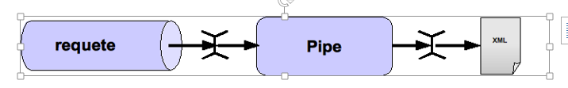
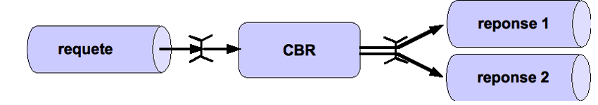
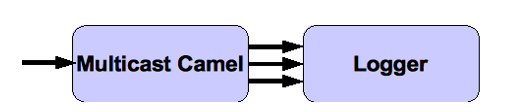
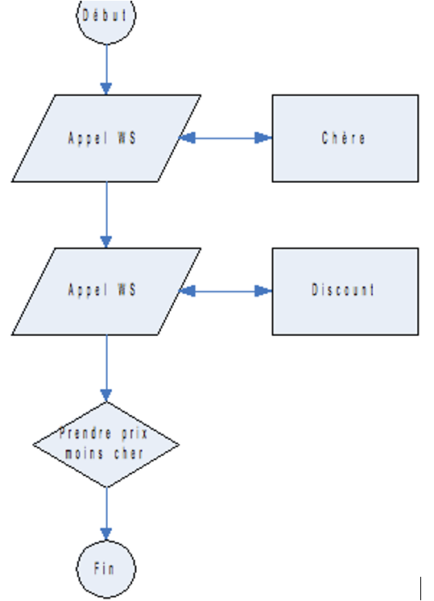

# Travaux Pratiques
# SOA : Architecture et Intégration d’Applications d’Entreprise


## Sommaire
- 1.Les Web Services
	- TP1 – Développer un premier Web Service
	- TP2 – Développer un Web Service en "WSDL-First"
	- TP3 – REST
- 2.Les MOM
	- TP4 – Prise en main du broker ActiveMQ
	- TP5 – Client JMS Java
	- TP6 – Bonus : AMQP
- 3.Les ESB
	- TP5 – Prise en main du framework Camel
	- TP6 – Aller plus loin avec Camel9ES
	- TP7 – Les EIP avec Camel
- 4.BPEL
	- TP8 – Installation du moteur BPEL et de l’IDE
	- TP9 – Hello BPEL !
	- TP10 – Comparateur de tarifs de billets d’avion
	- TP11 – Bonus : Processus durables14

## Configuration pour les TPs
Eclipse Mars (jee edition)
Apache CXF 3.1.2
Java 8
Tomcat 8	
	
## Les Web Services

## TP1 – Développer un premier Web Service

### Objectif

Ce premier TP va nous permettre de mettre en oeuvre un premier Web Service et d'installer l'environnement de développement.
L'objectif métier de ce service est de fournir un message d'accueil à l'adresse des partenaires se connectant au SI Resanet.

### Développement d'un POJO

- Dezipper le fichier CXF
- Créer un nouveau projet Java sous Eclipse (Dynamic Web Project) et cocher la case générer le fichier web.xml
- Sous Eclipse, aller dans Windows->Préférences-> Web Service configurer le path de CXF
- Sous Eclipse, aller dans Windows->Préférences->Servers->Runtime Environment installer Tomcat 8.
- Sous Eclipse, click droit sur le projet nouvellement créé, aller sur Préférences->Project Facet et cocher CXF.
- Sous Eclipse, click droit sur le projet nouvellement créé, aller sur Préférences->Targeted runtime et choississez Tomcat 8.
- Créer une nouvelle "User Library" CXF contenant l'ensemble des jar présents dans le répertoire lib de CXF et ajouter cette bibliothèque au classpath du nouveau projet
- Créer une interface com.resanet.ws.AccueilService contenant une fonction
	- afficherMessage prenant le nom du partenaire (ie. String) en paramètre d'entrée et renvoyant un message (ie. String) en sortie
- Créer une classe com.resanet.ws.AccueilServiceImpl implémentant l'interface précédente 
et renvoyant le message "RESANET : Bienvenue [nom_partenaire]"

### Mise en place du Web Service

- Ajouter l'annotation @WebService à l'interface nouvellement créée (sans paramètre) 
ainsi qu'à la classe l'implémentant (paramètres :endpointInterface="com.resanet.ws.AccueilService") : 
le Web service est prêt à être publié
- Créer une classe com.resanet.ws.ServerAccueil contenant une fonction main avec le contenu suivant :

```
System.out.println("Serveur démarré...");
AccueilService service =new AccueilServiceImpl();
String address ="http://localhost:9000/accueil";
Endpoint.publish(address, service);
```

- Démarrer la classe (le main lance un serveur Jetty)

### Appeler le Web Service

Nous allons appeler notre Web Service de 2 façons suivantes : 
		- Client SOAP 
		- programme Java.Client soapUI

- Installer et lancer soapUI
- Créer un nouveau projet TP1 et fournir l'adresse suivante (ie.WSDL initial) : http://localhost:9000/accueil?wsdl
- Déplier l'ensemble du projet et lancer la requête Request 1 avec le nom 
d'un partenaire fictif comme paramètre d'entrée (ie. remplacer le caractère?)
- Vérifier que le contenu de la réponse est correct Client Java

- Créer une classe com.resanet.ws.ConsumerAccueil contenant le code suivant :

```
URL wsdlURL =newURL("http://localhost:9000/accueil?wsdl");
QName serviceName =new QName("http://ws.resanet.com/","AccueilServiceImplService");
Service service = Service.create(wsdlURL, serviceName);
AccueilService client = service.getPort(AccueilService.class);
System.out.println(client.afficherMessage("Air France"));
```

- Lancer le programme
- Vérifier que le contenu de la réponse est correct

## TP2– Développer un Web Service en "WSDL-First"

### Objectif

L'objectif de ce TP est développer un Web Service via la méthode "WSDL-First". 
Ce service permettra d'ajouter et de lire les commentaires associés à un hôtel (il sera de type"Document/Literal Wrapped")

### Initialisation du WSDL

- Créer un projet Web sous Eclipse
- Configurer un serveur Tomcat sous Eclipse et y ajouter le projet
- Copier les fichiers commentaire.wsdl et commentaire.xsd dans le répertoire WebContent/wsdl
- Compléter le fichier commentaire.xsd en définissant :
	- un elément ajouter contenant le nom d'un hôtel et un commentaire associé
	- un elément lister contenant le nom d'un hôtel
	- un elément listerResponse contenant l'ensemble des commentaires associés (cf. maxOccurs="unbounded")
	- un élément commentaireFault contenant un code de type entier et une description
- Compléter le fichier commentaire.wsdl en définissant :
	- une opération ajouter(Literal Wrapped/SOAP 1.1/One-Way) permettant d'ajouter un commentaire à un hôtel 
	(si l'hôtel est inconnu, il est créé)
	- une opération lister(Literal Wrapped/SOAP 1.1/Request-Response) permettant de récupérer l'ensemble des commentaires d'un hôtel (si l'hôtel est inconnu, une fault est renvoyée)
	
### Implémentation du Web Service

- Générer l'ensemble des classes Java à partir du fichier WSDL
- Implémenter le service (utiliser une Map<String, <String>List> afin de simuler une base de données d'hôtels : String étant le nom de l'hôtel)
- Tester le service via soapUI et/ou un consommateur JavaWS

## TP2– WSDL avancée

L'objectif du TP est de sécuriser un webservice avec ws-security et utiliser ws-attachment (profil avancé sur ws-*).
Ce webservice sera un module de gestion de personne et comportera deux méthodes/opérations:
- affichePersonne retourne quelques informations d'une personne
- detailPersonne() retourne toutes les informations de la personne

Etapes 
- Créer un projet Web sous Eclipse
- Configurer un serveur Tomcat sous Eclipse et y ajouter le projet
- Créer un POJO Java Personne qui comportera les attributs suivant:
	- nom (chaine de caractère)
	- prenom (chaine de caractère)
	- age (un numéric)
	- sexe (un caractère)
	- photo (un dataHandler)
- Dans le fichier tomcat-user.xml qui se trouve dans le répertoire conf de TOMCAT, rajouter une ligne permettant de créer un user avec loin et password et un nouveau rôle.
Seul cet utilisateur pourra utiliser le webservice qui sera à mettre en place.
- Développer un webservice qui mettra à disposition 2 opérations
	- affichePersonne prend en argument un nom et retourne le nom, prénom, et l'âge de la personne.
	- detailPersonne prend en argument un nom et retourne tous les attributs de la personne.
- Construire un jeu de donnée.
- Activer le protocole MTOM
- Développer les méthodes 
- Sécuriser vos l'URL en utilisant les contraintes de sécurités
- Une fois fini, publier sur Tomcat et tester avec SOAPUI.

Observez-vous une différence dans le WSDL généré ?
Si oui laquelle.


## TP3– REST

### Objectifs

L'objectif de ce TP est mettre en oeuvre un service de gestion de voyages de type REST

### Installation du service

- Importer le projet <TP_WS_REST>dans Eclipse
- Le service de gestion des voyages fournit les opérations suivantes
	- créer un voyage
	- lire un voyage
	- lister les voyages
	- mettre à jour un voyage
	- supprimer un voyage
- Compléter la configuration CXF (ie. cxf-servlet.xml) et annoter l'ensemble des méthodes afin de fournir un service REST
- Tester le service à l'aide de SoapUI3.Service de recherche

- Modifier l'opération "lister les voyages" afin qu'elle puisse prendre en charge un paramètre permettant de chercher les voyages ayant un libellé donné
- Tester

## Les MOM

## TP4 – Prise en main du broker ActiveMQ

### Objectif

Prise en main du produit Apache ActiveMQ

### Consignes

- Décompresserle broker Apache ActiveMQ
- Se connecter sur la console d'administration (http://localhost:8161/)
- Créer une file nommée « mom.tp1 »
- Envoyer un message quelconque sur cette file
- Afficher le message MOM

## TP5 –Client JMS Java

### Objectif

Découverte des API JMS producer et consumer.

### Client JMS simple

- Créer un projet Java classique
- Importer le driver ActiveMQProducer

- Développer un client Java capable d’envoyer un message JMS sur une file
- Envoyer un header JMS (au choix) avec le messageConsumer

- Développer un client Java capabledelire sur une file JMS
- Afficher le contenu du message, ainsi que ses headers JMS

### Message Driven

- Développeret configure un composant Spring MessageListener afin de recevoir des messages JMS de façon asynchrone 
(MDP : Message Driven POJO)

## TP6 – Bonus : AMQP

### Objectif

Utilisation du standard de messaging AMQP

### Installation

- Installer le moteur ERLANG
- Installer le broker RabbitMQ
- Lancer et verifier que tout fonctionne3.Producer / consumer

- Développer un producer AMQP
- Développer un consumer AMQP

## Les ESB

## TP7 –Prise en main du framework Camel

### Objectif

Mettre en place un premier conteneur de services découvrant:

- Le composant *camel-file*
- Découverte du fonctionnement de Camel

### Mise en place

- Mettre en place une route avec 2 endpoints à l 'aide de l'API XML :
	- file consumer : scrute le répertoire <in> toutes les 10 secondes
	- file provider : copie le fichier reçu dans le répertoire <out>
- Lancer le programme et vérifier le bon fonctionnement avec un test

### Bonus

- Développer la même route avec le DSL Java

## TP8 –Aller plus loin avec Camel

### Mise en place

- Faire évoluer l’exercice précédent, en remplaçant le file poller par un consommateur JMS via le endpoint came-jms.
- Les messages pourront soit être envoyés via la console ActiveMQ, ou via un client Java.


## TP9 – Les EIP avec Camel

### Objectif
Implémentation des EIP dans Camel

### Ma première route Camel

- On utilisera le composant JMS en mode consumer, la brique EIP Pipe et le composant File en mode producer



### Content Based Router

- Implémenter l'EIP CBR se basant sur un header JMS nommé type *Message*
- On utilisera le component Camel JMS, la brique EIP Content BasedRouter pour transférer les messages vers 2 autres files JMS (choix basé sur le header).



### Multicast

- Implémenter l'EIP Multicast Camel en parallèle
- On injectera directement un message de test dans la brique Multicast, et on affichera à l'écran les messages de sorties.



### Message translator

- Implémenter l'EIP Message Translator
- On souhaite ajouter « World ! » au message d'entrée « Hello »
- On injectera directement les messages de tests dans l'implémentation de l'EIP, et on affichera à l'écran les messages de sorties.

## BPEL

## TP10 –Installation du moteur BPEL et de l’IDE

### Objectifs

- Installer l'environnement de développement.
- Prise en main de l'IDE.

### Mise en œuvre

- Vérification de l’installationd’unJDK 6.0
- Vérification de l’installation deAnt
- Installation de Eclipse 3.6 (Helios) maximum
- Installation des Jboss tools via le site update d'Eclipse

- http://download.jboss.org/jbosstools/updates/stable/indigo
- Sélectionner uniquement les éditeurs SOA

- Installation Jboss AS 5.1.0.GA JDK6
- Installation Jboss Riftsaw 2.0.0.Final

- Verification /édition du fichier de configuration
	- install/deployment.properties (cf README)
	
## TP10 – Hello BPEL !

### Objectifs

Développer un premier processus BPEL

- Débuter avec l'IDE
- Manipulation du langage
- Assimilation des concepts élémentaires

### Consignes

- Créer un nouveau processus BPEL synchrone nomméHelloBPEL
	- new BPEL project
	- new BPEL process file (à créer dans bpelContent)
	- new Apache ODE deployment descriptor
- Définir l'interface concrète dans le WSDL (Binding, Port, Service)
- Le processus doit retourner la même valeur que celle fournie en entrée du processus
- Déployer le processus

### Mise en œuvre

- Implémentation du processus BPEL et test avec l'utilitaire SoapUI

## TP11 – Comparateur detarifs debillets d’avion

### Objectifs

Comprendre la puissance du langage BPEL.

- Manipulation de données
- Utilisation des briques de base

Comprendre les interactions entre les webservices

### Consignes
Développer un processus BPEL synchrone, qui appelle 2 webservices partenaires (les WSDL des services sont fournis) :

- CieDiscountService
- CieChereService Le processus doit ensuite sélectionner le prix le moins élevé 
et le retourner dans la réponse accompagné du nom de la compagnie (DISCOUNT ou CHERE).

Flux métier



InterfaceOn fournit 3 WSDL

- Comparatif Prix Avion Artifacts.wsdl
- CompagnieChere.wsdl
- Compagnie Discount.wsdl

### Mise en œuvre
Implémenter le processus de choix de prix, et utiliser SoapUI pour simuler les partenaires.

## TP11 – Bonus : Processus durables

### Objectifs
Mettre en place des processus synchrones et asynchrones communiquant entre eux

### Consignes

- Créer un processus asynchrone qui possède untimerarrivant à expiration au bout de 5 secondes
- Le processus retourne la valeur 'OK'
- Créer un processus synchrone appelant le processus asynchrone
- Vérifier que la réponse du processus synchrone arrive au bout de 5 secondes

### Réaliser un design conforme

- Le design du processus de la partie 1 a un problème de conception.
- Que devons-nous prévoir afin qu'il n'y ait pas de problème?
- Implémenter la solution.


