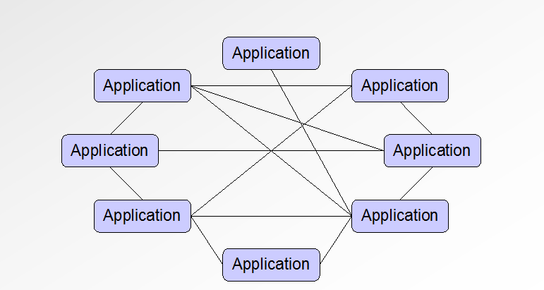
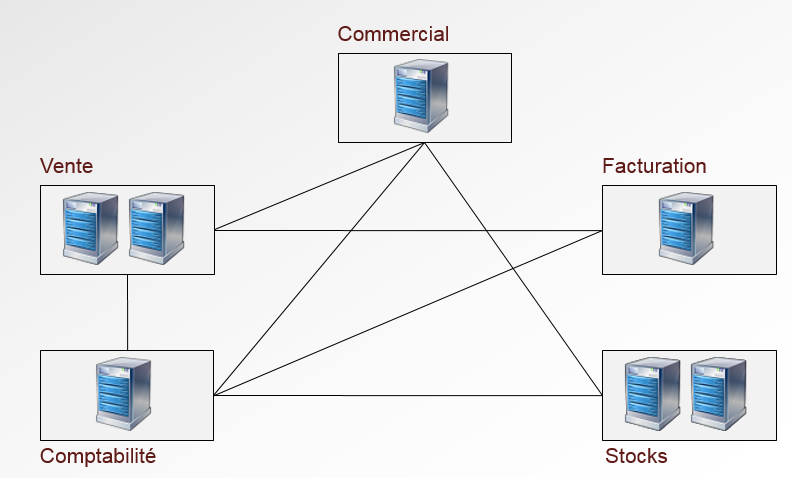
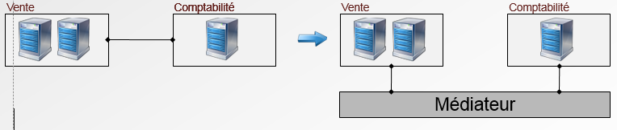
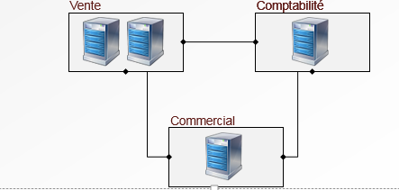
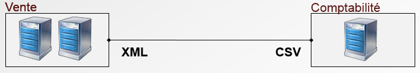
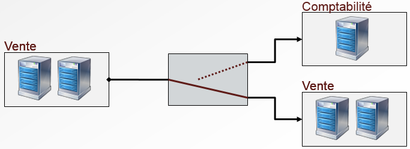
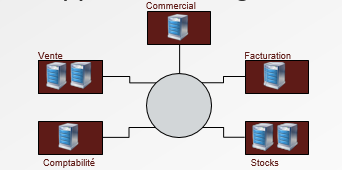

#Les problématiques d’intégration

<!-- .slide: class="page-title" -->

Notes :

## Contenu

- L’architecture des systèmes d’information

- Un monde complexe et hétérogène

- Synchronisme et asynchronisme

- Le couplage faible / couplage fort

Notes :

Fiabilité
Transport de données d'un ordinateur à un autre via un ensemble de réseaux.
Comparé à une application locale, il faut se préparer à gérer une multitude de problèmes.
Applications séparés par société, pays, continents...
Applications reliés par LAN, ligne tel., routeurs, satellites...
Toutes les étapes supp. Peuvent causer des délais ou des interruptions.
Lenteur
Performances incomparables avec une application locale
DANGER : ne pas concevoir une solution distribuée comme une solution locale (communication asynchrone / parallélisme).
Applications différentes
langages différents, OS différents, format de données...
Changement
Les applications changent tout le temps (TMA)
Évolution du SI : besoins métiers, besoins techniques, changements humains, « mode » (exemple : EJB), changements réglementaires
Un changement dans une application peut affecter l'ensemble des autres applications.
Il faut minimiser les dépendances -> couplage lâche entre applications.

## Un système d'information

Notes :

## La problématique d'intégration

Notes :

Les systèmes d'information des entreprises sont en général composé de centaines voire de milliers d'applications.

Créer une seule application métier pour tout gérer est impossible : trop lourd, trop complexe, trop dangereux...les grands acteurs de l'intégration (ERP : SAP, Oracle,PeopleSoft) arrivent a couvrir une grande partie des besoins mais pas tout.

De plus se lier à un seul éditeur est stratégiquement dangereux (exemple : prix maintenance SAP et Oracle). On peut en répartissant les applications choisir la meilleure solution à chaque étage.

## Intégration – Les challenges

- Les réseaux ne sont pas fiables
	- Système distribué : contraintes fortes

- Les réseaux sont lents
	- Système distribué≈Système asynchrone

- Les applications sont différentes à tous les niveaux
	- Système d'exploitation
	- Implémentation
	- Format de données

Notes :

Fiabilité
Transport de données d'un ordinateur à un autre via un ensemble de réseaux.
Comparé à une application locale, il faut se préparer à gérer une multitude de problèmes.
Applications séparés par société, pays, continents...
Applications reliés par LAN, ligne tel., routeurs, satellites...
Toutes les étapes supp. Peuvent causer des délais ou des interruptions.
Lenteur
Performances incomparables avec une application locale
DANGER : ne pas concevoir une solution distribuée comme une solution locale (communication asynchrone / parallélisme).
Applications différentes
langages différents, OS différents, format de données...
Changement
Les applications changent tout le temps (TMA)
Évolution du SI : besoins métiers, besoins techniques, changements humains, « mode » (exemple : EJB), changements réglementaires
Un changement dans une application peut affecter l'ensemble des autres applications.
Il faut minimiser les dépendances -> couplage lâche entre applications.

## Intégration – Les challenges

- Le changement est inévitable
	- Changement métier (stratégie, règlement...) 
	- Changement technique
	- Changement humain
	- Changement de « mode » (exemple : EJB)

Notes :

## Intégration – Les fonctions de base

- Médiation – Réduction des adhérences entre applications
<figure>
    
</figure>

- Connectivité – support de multiples protocoles de transport
<figure>
    
</figure>

Notes :

## Intégration – les fonctions de base

- Transformation –Support de différents types de données

- Routage –Routage des messages entre applications

Notes :

## Style d'intégration – Les fichiers

- Exemples : FTP, CFT, Copie locale, etc.

- Avantages
	- Découplage des applications
	- Simple à mettre en place
	- Pas besoin d'outils d'intégration

- Inconvénients
	- Format des données
	- Temps de latence→biais de synchronisation
	- Gestion des fichiers complexes

Notes :

## Style d'intégration – BDD partagées

- Exemples : Oracle, PostgreSQL, etc.

- Avantages
	- SQL→format des données unifié
	- Schéma partagé → pas de conflit sémantique

- Inconvénients
	- Couplage fort au schéma→forte sensibilité au changement
	- Progiciel : impossibilité de changement du schéma

Notes :

## Style d'intégration – RPC

- Exemples : CORBA, RMI, etc.

- Avantages
	- Risque de problème sémantique faible
	- Méthode « naturelle » : intégration facilitée

- Inconvénients
	- Méthode « naturelle » : contraintes comparée à un appel local (performances, robustesse)
	- Couplage applicatif fort

Notes :

## Style d'intégration – Messages

- Exemples : MOM, SMTP, Web Services, etc.

- Avantages
	- Découplage des applications
	- Robuste
	- Performant

- Inconvénients
	- Légère latence
	- Adapté aux « petits » paquets de données

Notes :

## Histoire de l'intégration – Le Point à point

- Liaisons entre applications
	- Directes
	- Non standardisées
	
-*Avantages*
	- Facile et rapide à mettre en place (dans un premier temps)
	- Ne nécessite pas d'installer une solution tierce

-*Inconvénients*
	- Forte adhérence entre applications
	- Complexité maintenance / supervision

Notes :

## Histoire de l'intégration – Les MOM

- MOM – Message-Oriented Middleware

- JMS – API Java supportée par une grande majorité des éditeurs de MOM, devient un standard de fait

- Exemples : Apache ActiveMQ, IBM WebSphere MQ

- *Avantages*
	- Solution simple

- *Inconvénients*
	- API hétérogènes 
	- Ne couvrent pas l'ensemble des problématiques d'intégration (exemple : connectivité, routage, etc.)

Notes :

## Histoire de l'intégration – Les EAI

- EAI – Enterprise Application Integration
<figure style="display: block; float: right; width: 40%">
    
</figure>

- *Avantages*
	- Solution complète d'intégration

- *Inconvénients*
	- Propriétaire
	- Prix
	- Complexe
	- Centralisé→SPOF : « Single Point Of Failure »

Notes :

## Les Enterprise Service Bus

- Besoin d'une solution d'intégration
	- Distribuée
	- S'appuyant sur les standards

- Opposition frontale à la vision EAI (centralisée et propriétaire)

- Technologie s'appuyant sur les bonnes pratiques d'intégration et sur l'écosystème existant
	- MOM
	- Patterns d'intégration : routage / validation / transformation

- L'ESB se compose de deux éléments principaux
	- Le bus de messages et les conteneurs de services

Notes :

<!-- .slide: class="page-questions" -->