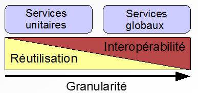
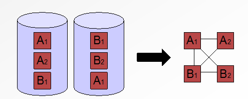
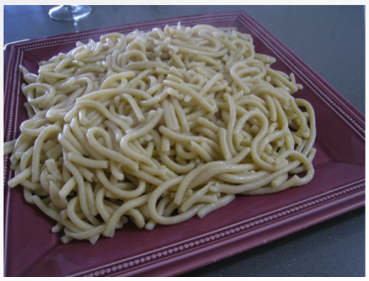

#Service Oriented Architecture

<!-- .slide: class="page-title" -->

Notes :

## Contenu

- Les grands principes

- Démystifier la SOA

- Pourquoi, comment et pour qui ?

Notes :

## SOA – Pourquoi ?

- L'entreprise doit s'adapter continuellement

- L'entreprise est de plus en plus dépendante des technologies
	- →le SI peut devenir un frein

- ***« C'est pas notre faute, c'est un problème informatique... »***
	- Acteurs métiers 
	- Acteurs techniques

- → Le SI doit être le moteur du business
<figure style="position: absolute; bottom: 250px; right: 880px;">
    
</figure> 

Notes :

## La SOA, qu'est ce c'est ?

- « désigne un type d'**architecture** fournissant un ensemble de **services localisables**, à des applications clientes ou à d'autres services **distribués** sur un réseau, via des **interfaces** publiées »

- SOA = « IOA » (Interface Oriented Architecture)
	- Abstraction
	- Couplage lâche (couplage faible ou léger)

- Couplage lâche
	- Les systèmes qui entrent en interaction ne connaissent pas intimement les détails d'implémentation des uns et des autres

Notes :

## SOA – Principes

- Simplicité
	- Efficacité
	- Communication métier/technique

- Flexibilité et maintenabilité
	- Pérennité des systèmes

- Réutilisabilité
	- Réduction des anomalies
	- Gain de productivité

- Indépendance vis à vis des technologies
	- S'appuyer sur les standards et les bonnes pratiques

Notes :

## SOA – Comment ?

- Service = élément central de la démarche SOA

- Service = Contrat
	- Fonctionnalités métier
	- Interfaces
	- Données
	- Performances, robustesse

- Intégration via des services en utilisant les standards
	- Les systèmes communiquent via des protocoles et des formats
	- La vision « service » remplace la traditionnelle vision « silo 
	- Intégration de l'existant via des services
	
Notes :

## SOA – Les Services

- Le Service

	- Assure et respecte la mise en œuvre d’un contrat
	- Autonomie
	- Peut être invoqué quelle que soit sa localisation

- Propriétés intrinsèques d’un service
	- Ré-utilisabilité
	- Interopérabilité

<figure style="position: absolute; bottom: 50px; right: 100px;">
    
</figure>

Notes :

## SOA – Évolution des SI

- Intégration des systèmes via des Services
	- Les systèmes communiquent via des protocoles et des formats standards
	- La visionserviceremplace la visionsilo
	- Le SI devient distribué
	- L’intégration de l’existant via des services

<figure style="position: absolute; bottom: 50px; right: 100px;">
    
</figure>	

Notes :

## The Spaghettis Incident ?

- Une architecture orientée services peut vite très rapidement devenir comme cela

<figure style="position: absolute; bottom: 50px; right: 200px;">
    
</figure>

Notes :

## SOA et les outils de mise en place

- SOA est autant une démarche métier qu'une démarche technique

- Les principes de mise en œuvre d'une architecture SOA
	- Approche « service » : conteneurs de services
	- Simplicité, Standard, Réutilisation, Maintenabilité
	- Solutions ESB
	- Solutions BPEL
	- Solutions 100% Web Services (WSOA)
	- Solutions 100% Messaging (JMS, AMQP)
	- → combinatoire de ces solutions

Notes :

## Principes d'une architecture SOA

- Contrat Standard- Assurer l'interopérabilité

- Couplage lâche- Minimiser les dépendances entre consommateur et producteur

- Abstraction– S'abstraire de l'implémentation

- Réutilisabilité– Gagner en productivité

- Autonomie– Minimiser les dépendances du service vis à vis de son environnement (services, systèmes existants...)

- Sans état- Simplifier la concurrence, la réutilisabilité, la maintenance, les performances ...

- Localisable –Trouver le service répondant à un besoin

- Composable –Créer de nouveaux services à partir des services existants

Notes :

## SOA – En résumé

- Style d'architecture basé sur

	- un découpage intelligent
	- le respect des contrats d'interface
	- des implémentations simples et efficaces
	- des protocoles libres et ouverts
	- des standards
	
	**Keep it simple !**

Notes :

<!-- .slide: class="page-questions" -->