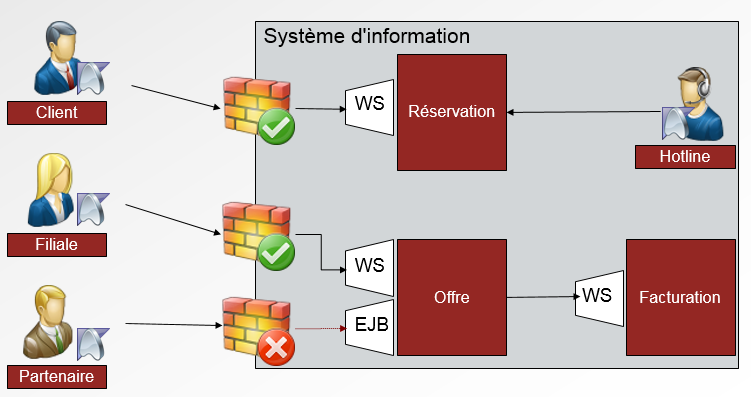
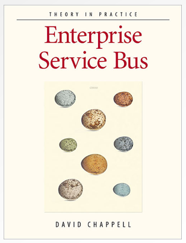
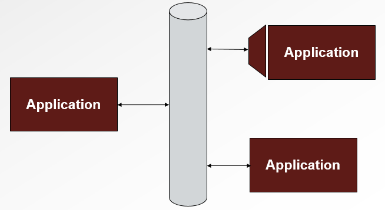
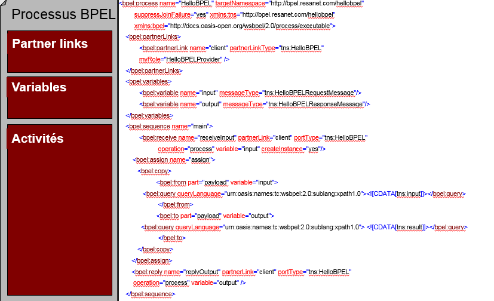

# Echanger des messages entre les services

<!-- .slide: class="page-title" -->

Notes :

## Plan

- Les Web Services

- Les MOM – Messages Oriented Middleware

- Les ESB – Entreprise Service Bus

- BPEL – Business Process Execution Language

Notes :

# Web Services

<!-- .slide: class="page-title" -->

Notes :

## Les Web Services : c'est quoi ?

- Un Web Service est un module logiciel autonome

- Un Web Service fournit une description de ses capacités

- Un Web Service est accessible depuis un réseau donné
	- Intranet
	- Internet

- Un Web Service communique via des protocoles standards de communication (HTTP essentiellement)

- Un Web Service envoie et reçoit des données formatées en XML

Notes :

## Dans Web Service, il y a Web
- World Wide Web  HTTP
- Les Web Services sont accessibles le plus souvent via HTTP
	- Standard
	- Interopérable
	- Simple
	- Universel
	- Passe-partout(ie. aucun problème de Firewall)

Notes :

## Dans Web Service, il y a Web

- Avec le temps, les Web Services ont connu de nouveaux supports
	- SMTP, FTP
	- JMS
	- ...

Notes :

## Histoire de l'informatique distribuée

- L'essor des technologies objet a permis de s'affranchir des problématiques techniques/matérielles liées aux systèmes distribués

- CORBA : Common Object Request Broker Architecture

- Monde Java : RMI

- Monde Microsoft : .NET Remoting

- …

- Web Services : pourquoi s'appuyer sur une/des nouvelle(s) technologie(s) ? → Le réseau n'est pas homogène

Notes :

## Les Web Services dans l'Entreprise

Notes :

## Web Services et SOA

- SOA est autant une démarche métier qu'une démarche technique

- Les principes de mise en œuvre d'un Web Service sont proches de ceux d'une architecture SOA

	- Approche « Service »
	- Simplicité, Standard, Réutilisation, Maintenabilité

- Web Service n'est pas SOA mais c'est un outil idéal pour la mettre en place

- Les Web Services sont la technologie la plus simple et la plus courante pour mettre en place une architecture orientée services

Notes :

#MOM

<!-- .slide: class="page-title" -->

Notes :

## Les MOM – Message Oriented Middleware

- Les MOM transportent des messages

- Les communications avec les MOM sont obligatoirement asynchrone

	- Messaging 100% asynchrone
	- Pas de question / réponse nativement
	- Système de « fire and forget »
	- Uniquement acknowlegdement technique ou transactionnel

Notes :

## Propriétés des MOM

- Propriétés intrinsèques aux MOM

	- Communication asynchrone
	- Pas de routage natif
	- Pas de transformation de données (autre que l’encoding)
	- Persistance des messages marqués « durable »
	- Fiabilité

Notes :

## Utilisation des MOM

- De nos jours, les MOM sont partout

- Ils représentent la plupart « des tuyaux » des systèmes d’information

- 2 modes principaux d’utilisation :
	- « direct » : un service produit un message dédié à un autre service
	- « publish / subscribe » : un service produit un message qui peut être récupéré par n’importe quel autre service abonné au canal

	
Notes :

# ESB

<!-- .slide: class="page-title" -->

Notes :

## ESB – Entreprise Service Bus

- 2004 : Naissance de l’ESB - David Chappell

Notes :

## Enterprise Service Bus par D. Chappell

- Besoin d'une solution d'intégration
	- Distribuée et qui s'appuyant sur les standards

- Opposition frontale à la vision EAI (centralisée et propriétaire)

- Technologie s'appuyant sur les bonnes pratiques d'intégration et sur l'écosystème existant
	- MOM
	- Patterns d'intégration : routage / validation / transformation

- L'ESB se compose de deux éléments principaux
	- Le bus de messages
	- Les conteneurs de services

Notes :

## Le bus de messages

- Pattern d'intégration définissant une architecture permettant

	- De faire travailler ensemble des applications distantes
	- De pouvoir ajouter/supprimer des applications sans affecter les autres

<figure style="position: absolute; bottom: 50px; right: 100px;">
    
</figure>	

Notes :

## Le bus de message en détail

- Un bus de message est la combinaison de :

- D'une infrastructure de communication commune (par ex: MOM)
	- S'abstraire de l'hétérogénéité du Système d'Information

- D'un ensemble de commandes de gestion
	- Exemples : écrire des données à telle adresse
	- Ensemble des possibilités offertes par le bus

- D'un modèle de données communs
	- Exemple : structure XML (schéma XSD)
	- Langage commun pour assurer la communication entre applications hétérogènes

Notes :

## Les conteneurs de services

- Alors que l'ensemble des services (routage, transformation, connectivité) sont centralisés au sein d'un EAI, ils sont distribués au sein d'un ESB

- Les conteneurs de services fournissent l'ensemble des services d'un ESB

- Un conteneur de services peut être comparé à un serveur d'application léger
	- Facilement et rapidement installable
	- Peu gourmand

- Ils communiquent entre eux en utilisant le bus de messages comme médiateur

Notes :

## Un ESB est distribué par définition

- Un ESB n'est pas centralisé

- Difficile d'imaginer ou de vendre un(e) produit/technologie distribué(e)

- Les ESBs pâtissent de la mauvaise réputation des EAI
	- Propriétaire
	- Lourd
	- Coûteux

- David Chappell propose notamment de s'appuyer sur les MOM et notamment sur JMS pour gérer la distributivité

Notes :

# BPEL

<!-- .slide: class="page-title" -->

Notes :

## Le langage BPEL

- Business Process Execution Language

- Langage

	- Description de business process
	- Interactions avec des Web Services
	- Écrit en XML

- Standard issu du consortium OASIS

	- WSBPEL → version 2.0 avril 2007
	- Différentes implémentations (Oracle, Apache, etc.)

<figure style="position: absolute; bottom: 400px; right: 50px;">
    
</figure>	

Notes :

## Business Process

- Business Process (processus métier)
	- Répond à un besoin d'entreprise
	- S'adapte à un modèle de données métier
	- Réalise un ensemble d'actions et de tâches
	- Est un service

- Exemple de Business Process

	- Réservation de billets d'avion
	- Format d'entrée imposé
	- Vérifier disponibilité, appeler facturation, notifier client

Notes :

## BPEL – Quelle utilité ?

- Processus BPEL implémente un Business Process

- Processus BPEL expose un Web Service
	- Business Process exposé via Web Service (en BPEL)

- Orchestrateur de Web Services

- Abstraction

- Un processus BPEL orchestre l'appel à d'autres WS
	- Processus BPEL
	- Services externes

- Granularité inconnue du service appelé

Notes :

## Un processus BPEL

- Processus BPEL
	- WSDL
		- Types
		- Messages
		- Opérations / PortTypes

- BPEL
	- PartnerLinks
	- Variables
	- Activités

Notes :

## Un processus BPEL

<figure style="position: absolute; bottom: 50px; right: 50px;">
    
</figure>

<!-- .slide: class="page-questions" -->
