#Les Web Services

<!-- .slide: class="page-title" -->


Notes :


## Plan

- Deux grandes familles : SOAP & REST

- Java et les Web Services (frameworks)

- Web Services asynchrones

- Le déploiement

- Les bonnes pratiques en Web Services

- Aller plus loin (WSDL, WS-*, MTOM, etc.)

 
Notes :


## Web Services : WS-* et REST

- WS-*
	- Solution standard
	- RPC synchrone et/ou asynchrone
	- S'appuie sur SOAP (communication) & WSDL (contrat)
	- Intégration d'un écosystème orienté entreprise
		- WS-Security / WS-Addressing / Ws-ReliableMessaging ...

Notes :


## Web Services : WS-* et REST

- REST
	- S'appuie sur les fondations HTTP
	- « Architecture Orientée Ressources »
	- Opérations de base : GET / POST / PUT / DELETE
	- Alternative sérieuse au monde WS-*
		- Simple à mettre en œuvre
		- Pas de nouvelles technologies à maîtriser

Notes :


## Les fondations des Web Services WS-* (1/3)

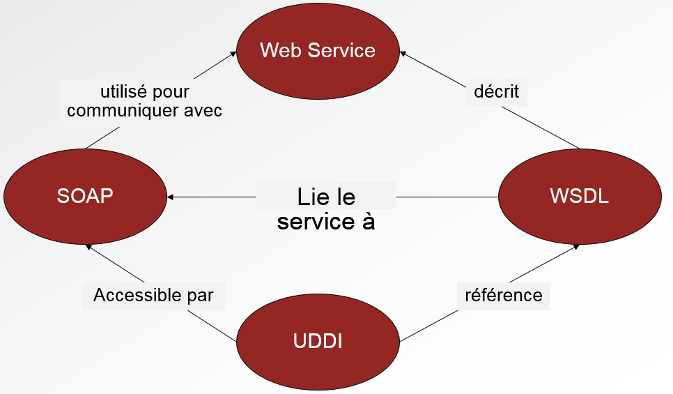

Notes :


## Les fondations des Web Services WS-* (2/3)

- WSDL
	- Décrit le service
	- WSDL = Contrat

- SOAP
	- Langage/Protocole de communication
	- Permet la transmission de messages standardisés entre acteurs d'un système distribué

	
Notes :


## Les fondations des Web Services WS-* (3/3)
	
- Web Services
	- Implémentation du service
	- Indépendant des technologies : Java, .Net, Python …

- UDDI
	- Référence les services
	- « Parent pauvre » du monde WS-*

Notes :


## REST : retour vers le futur

- REST = REpresentational State Transfer

- Créé par Roy T. Fielding en 2000

- Le principe de REST est de revenir aux fondamentaux de l'architecture du Web
	- URL→ identifie les ressources
	- HTTP → fournit les opérations
		- GET : récupérer une ressource
		- POST : créer une ressource
		- PUT : mettre à jour une ressource
		- DELETE : supprimer une ressource

- REST s'appuie sur les principes du web pour mettre en œuvre des web services CRUD (ie. Create/Read/Update/Delete)

Notes :


## WS-* et REST : la guerre ?

- WS-* (SOAP / WSDL)
	- Majoritaire au sein des systèmes d'informations
	- Web Service = SOAP + WSDL
	- Gestion de la sécurité des données

- REST
	- Architecture de plus en plus courante
	- Adaptée aux opérations CRUD
	- Adaptée à la gestion des ressources

```
On a souvent tendance à opposer ces deux mondes pourtant
WS-* et REST sont complémentaires
```

Notes :


# Web Services et Java


<!-- .slide: class="page-title" -->


Notes :


## JEE et les Web Services

- Le standard WS-* au sein de la plateforme JEE est JAX-WS

- JAX-WS est le successeur de JAX-RPC qui est aujourd'hui obsolète (API « pruned » dans JEE 6)

- JSR 181 fournit à JAX-WS les annotations Web Services

- SAAJ est une spécification/API permettant de manipuler des enveloppes SOAP à un niveau 
d'abstraction plus bas que JAX-WS (SAAJ est notamment utilisé dans le cadre des Handlers)

- JAX-RS est l'API Java de référence pour la mise en œuvre d'une architecture REST

Notes :


## JAX-WS et JAX-RS : les implémentations

- JAX-WS
	- Apache CXF
	- Apache Axis 2
	- Oracle/Sun Metro (RI)

- JAX-RS
	- Apache CXF
	- Oracle/Sun Jersey (RI)

- Ces implémentations apportent des fonctionnalités équivalentes et/ou différentes
	- Support WS-* (WS-Adressing, WS-Security, ...), Binding XML (JAXB, Aegis, XMLBeans, ...)

Notes :


## CXF

- CXF est un projet Apache dédié à la mise en œuvre des Web Services WS-* et REST

- CXF est le successeur de XFire au sein de la fondation Apache

- CXF nous offre les avantages suivants
	- Respecte les standards Web Service WS-* et REST
	- Léger
	- Performant
	- Intégration à Spring
	- Lien fort avec les projets « Intégration » de la fondation Apache : ActiveMQ, ServiceMix, Camel

Notes :


## JAX-WS

- JAX-WS est née officiellement en 2006
	- Adoption par l'industrie
	- Retour d'expérience

- Il est tout à fait possible de ne pas utiliser JAX-WS pour développer des Web Services au sein de la plateforme JEE
	- Servlet + XML
	- JAX-RPC
	- API propriétaire

- JAX-WS est malgré tout conseillée pour les développements Web Services
	- Standard, Simple

Notes :


## JAX-WS en détail

- JAX-WS permet de simplifier le développement de Web Services

- Pour cela, JAX-WS s'appuie sur
	- JAXB pour le mapping Java/XML
	- JSR 175 pour les annotations Java
	- JSR 181 pour les annotations Web Services

- Comparé à JAX-RPC, JAX-WS
	- Simplifie les développements Web Services
	- Gère les appels asynchrones
	- Gère les appels non HTTP

Notes :


#Développer un Web Service SOAP en Java

<!-- .slide: class="page-title" -->


Notes :


## Comment développer un WS en Java ?

- Java-First (ou Code-First ou Bottom-Up)
	- Implémentation du service
	- Génération automatique du fichier WSDL et du schéma XSD

- Contract-First (ou Top-Down)
	- Création du fichier WSDL et du schéma XSD
	- Génération automatique des classes Java
		- Classes JAXB (requête/réponse/erreurs)
		- Interface du service
	- Implémentation du service

Notes :


## Étapes de création d'un WS en Java-First

- Créer unService Endpoint Interface(SEI)

- Le SEI consiste en une interface Java décrivant les opérations exposées par le Web Service : c'est le contrat liant le service aux clients

- Implémenter le Web Service

- Il s'agit d'une classe Java implémentant le SEI

- Annoter les classes afin d'assurer la compatibilité avec JAX-WS

- Déployer le Web Service

Notes :


## Créer l'interface Java (SEI)
```
package com.resanet.ws;

import javax.jws.WebMethod;
import javax.jws.WebParam;
import javax.jws.WebResult;
import javax.jws.WebService;

@WebService(
targetNamespace ="http://www.resanet.partenaires.com")

public interface VoyageService {

@WebMethod(operationName ="verifierDisponibilite")
@WebResult(name ="disponibilite")
public boolean estDisponible(@WebParam(name ="reference")String ref);
}
```

Notes :


## Créer l'interface Java (SEI)


- SEI = Contrat du Web Service
- Toutes les méthodes de l'interface sont exposées


Notes :


## Implémenter le service

```
package com.resanet.ws;

import javax.jws.WebService;

@WebService(serviceName ="voyageService", 
endpointInterface ="com.resanet.ws.VoyageService")

public class VoyageServiceImpl implements VoyageService {

public boolean estDisponible(String ref) {…}
}
```


- Implémente les opérations décrites par le SEI
- L'implémentation utilise la même annotation *@WebService que le SEI*


Notes :


## Recommandations

- La mise en œuvre du SEI est optionnelle mais fortement conseillée
	- Une interface « cache » l'implémentation
	- Permet de respecter l'approche « Contrat » des Web Services

- L'implémentation explicite (*ie.implements*) est optionnelle 
mais fortement conseillée afin d'éviter des incohérences SEI/SIB

- Chacune des annotations fournit plusieurs paramètres
→ il est important de fournir le plus d'informations possibles afin d'éviter toute ambiguïté

Notes :


## Publication d'un Web Service

```
package com.resanet.ws;
import javax.xml.ws.Endpoint;

public class ServerVoyage {
public static void main(String[] args) {
	VoyageService service =newVoyageServiceImpl();
	String address ="http://localhost:9000/voyage";
	Endpoint.publish(address, service);
}
}
```

La publication «Endpoint.publish» est intéressante dans le cadre de POC / Prototypage mais ne doit pas être utilisée en production

Notes :


## Développer un client Web Service

```
package com.resanet.ws;
import java.net.URL;
import javax.xml.namespace.QName;
import javax.xml.ws.Service;
public class ConsumerVoyage {

public static void main(String[] args) {
try{
URL wsdlURL =
	new URL("http://localhost:9000/voyage?wsdl");
QName serviceName =
	newQName("http://www.resanet.partenaires.com","VoyageService");
Service service = Service.create(wsdlURL, serviceName);
VoyageService client = service.getPort(VoyageService.class);
...
```

Notes :


## Appel à un Web Service

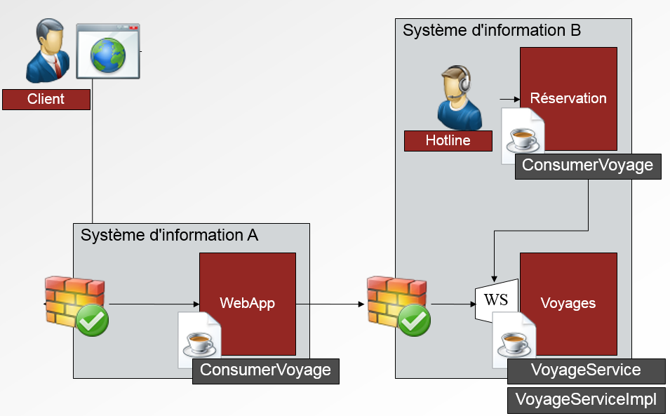


Notes :


## Derrière le Java-First (coté Serveur)

- La publication du Web Service
	- Génère le WSDL (ie. « Contrat »)
	- Ouvre le port spécifié

- La réception de la requête SOAP
	- Désérialise la requête SOAP (ie. XML → Java)
	- Appelle la fonction Java correspondante
	- Génère une réponse SOAP (ie. Java → XML)
	- Envoie la réponse SOAP via HTTP

Notes :


## Derrière le Java-First (coté Client)

- L'appel au Web Service

	- Génère une requête SOAP (ie. Java→ XML)
	- Envoie la requête SOAP via HTTP
	- Met en attente le client

- La réception de la réponse SOAP
	- Désérialise la requête SOAP (ie. XML → Java)
	- Stoppe l'attente du client
	- Renvoie la réponse Java

Notes :


## Format de la requête/réponse SOAP

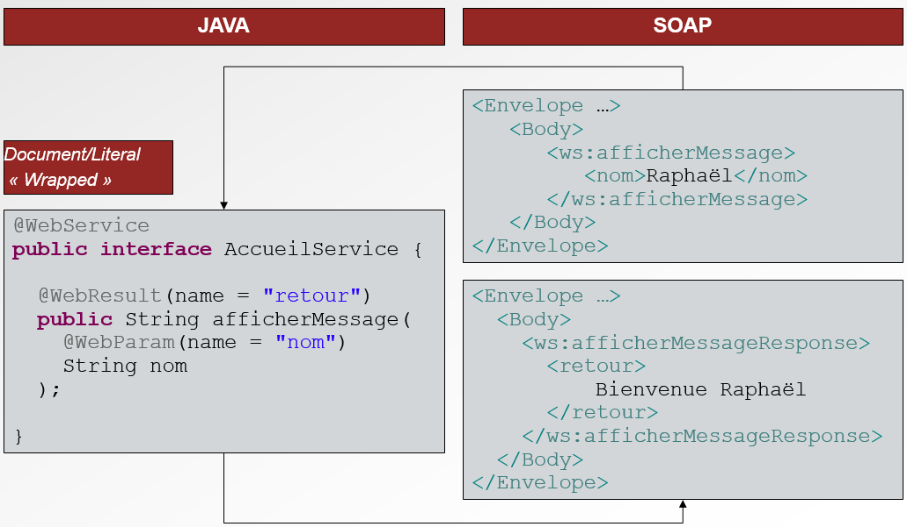


Notes :


<!-- .slide: class="page-questions" -->


<!-- .slide: class="page-tp1" -->


#SOAP

<!-- .slide: class="page-title" -->

Notes :


## SOAP : Protocole de communication

- SOAP : protocole et format de messages défini par W3C
	- A l'origine, SOAP =Simple Object Access Protocol
	- SOAP n'est plus un acronyme
	- SOAP aujourd'hui ≈«SOA Protocol »

- Permet la transmission de messages standardisés entre acteurs d'un système distribué

- SOAP : successeur de XML-RPC
	- XML-RPC moins complet que SOAP
	- Orienté RPC uniquement

Notes :


## SOAP : Protocole de communication
	
- Versions
	- 1.1 : mai 2000 – version la plus couramment utilisée
	- 1.2 : seconde édition en avril 2007

Notes :


## SOAP, c'est quoi ? (1/2)

- Un message SOAP
	- Est un message XML
	- Possède une structure propre (ie. enveloppe SOAP)
	- Est indépendant de la couche transport : HTTP, JMS, ...

- Un message SOAP contient les éléments
	- Envelope qui en est est la racine
	- Header qui fournit des informations techniques :
		- Routage
		- Adressage …

Notes :


## SOAP, c'est quoi ? (2/2)

- 
	- Body qui contient le contenu utile (*ie. payload*) du message :
		- Requête
		- Réponse
		- Erreur

Notes :


## L'enveloppe SOAP

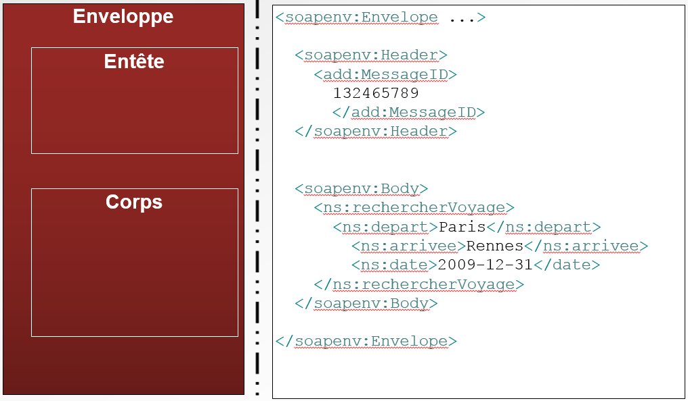


Notes :


## La racine SOAP

- La racine de l'enveloppe SOAP doit spécifier la version SOAP
- SOAP 1.1

```
<soapenv:Envelope 
xmlns:soapenv="http://schemas.xmlsoap.org/soap/envelope/">
```

- SOAP 1.2

```
<soapenv:Envelope
xmlns:soapenv="http://www.w3.org/2003/05/soap-envelope">
```	
	
Notes :


## La racine SOAP
	
- Remarques
	- SOAP 1.1 et 1.2 sont relativement proches
	- SOAP 1.2 clarifie les ambiguïtés présentes dans SOAP 1.1; malgré cela, SOAP 1.1 reste majoritaire

Notes :


## Header SOAP

- Le Header SOAP est optionnel

- Le Header SOAP peut contenir n'importe quelle structure XML

- Il peut contenir des données utilisateur « techniques » (p. ex. identifiant, timestamp …) 
ou des informations liées aux spécifications WS-* (p. ex. WS-Addressing, WS-Security ...)

```
<Envelope xmlns="http://schemas.xmlsoap.org/soap/envelope/" 
xmlns:ns="http://www.resanet.com">
	<Header>
	<ns:id>ID_0123</ns:id>
	</Header>
	<Body>…</Body>
</Envelope>
```
Notes :


## Body SOAP (1/2)

- Le Body SOAP contient le message à transmettre au destinataire final

- Le Body SOAP est obligatoire

- Body SOAP = « Payload »

- Une ou plusieurs structures XML peuvent être transmises via le Body SOAP
	- Le format du contenu est spécifié par le fichier WSDL
	- Document ou RPC
	
Notes :


## Body SOAP (2/2)

```
<Envelope xmlns="http://schemas.xmlsoap.org/soap/envelope/" 
xmlns:ns="http://www.resanet.com">
<Body>
<ns:enregistrerUtilisateur>
<ns:utilisateur>
<ns:nom>Holmes</ns:nom>
<ns:prenom>Sherlock</ns:prenom><
ns:adresse>221B Baker Street</ns:adresse> 
<ns:ville>Londres</ns:ville>
</ns:utilisateur>
</ns:enregistrerUtilisateur>
</Body>
</Envelope>
```

```
Le contenu du Body est déterminé par les paramètres JAX-WS 
(ie. annotations)
→ Plus d'informations au chapitre WSDL
```

Notes :


## Fault SOAP

- Unique structure XML du Body SOAP définie par les spécifications SOAP

- Permet de remonter une erreur au client SOAP

- Une Fault SOAP est remontée au sein du Body uniquement en cas d'erreur afin d'informer le client du problème

- JAX-WS s'appuie sur les exceptions Java afin de générer les Fault SOAP

Notes :


## Contenu d'une Fault SOAP

- faultcode : identifiant de l'erreur basé sur types prédéfinis→ déterminé automatiquement par CXF
	- VersionMismatch : version de SOAP non valide
	- MustUnderstand : header non « compris »
	- Client : message mal formatée ou non valide
	- Server : erreur de traitement du message

- faultstring : description→ attribut message de l'exception

Notes :


## Contenu d'une Fault SOAP

- faultactor : URL du composant à l'origine de l'erreur→ non pris en charge par le mapping JAX-WS (pris en charge par les Handlers)

- detail : informations concernant l'erreur→ Élément correspondant à l'exception

```
L'élément *soap:Fault* contient quatre sous-éléments
```

Notes :


## Mapping Exception/Fault par défaut

```
@WebService(targetNamespace = "http://business.resanet")
public interface BusinessService {

  public int reserver(...) throws VoyageNonDisponibleException;
}
```
<figure style="position: absolute; bottom: 320px; right: 10px;">
    
</figure>

```
<Envelope xmlns="http://schemas.xmlsoap.org/soap/envelope/">
   <Body>
      <Fault>
         <faultcode>soap:Server</faultcode>
         <faultstring>Le voyage n'est pas disponible</faultstring>
         <detail>
            <ns1:VoyageNonDisponibleException xmlns:ns1="http://business.resanet"/>
         </detail>
      </Fault>
   </Body>
</Envelope>
```

Notes :


#WSDL

<!-- .slide: class="page-title" -->

Notes :


## Qu'est ce que le contrat d'un Web Service

- Un contrat de Web Service doit fournir
	- Son usage (opérations fournies)
	- Les messages échangés
	- Modèle de données des messages
	- Informations précisant comment utiliser le service
	- Informations précisant où trouver le service

- Un contrat de Web Services est organisé en 3 parties
	- Quelle est l'utilité et les possibilités offertes par le service ?
	- Comment accéder au service ?

- Où accéder au service ?

Notes :


## Structure d'un contrat

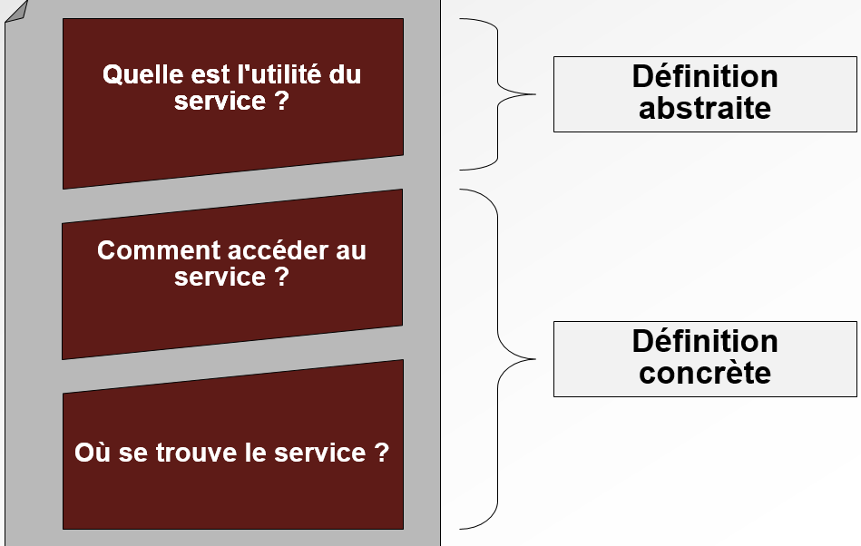

Notes :


## Comment écrire un contrat

- Tout document contenant une définition abstraite et concrète est un contrat de Web Services

- Quel format utilisé ?
	- Texte
	- Word
	- Mail
	- XML


- Démarche SOA s'appuyer sur les standards
	- Standard contrat WS = WSDL

Notes :


## WSDL

- WSDL :Web Services Description Language
	- ie. Description de Web Services

- WSDL = définition du service

- WSDL = langage XML

- Standard défini par le W3C
	- En mars 2001 (soit après SOAP)
	- Dernière version : 2.0 (non prise en charge par CXF)


Notes :


## Structure d'un WSDL

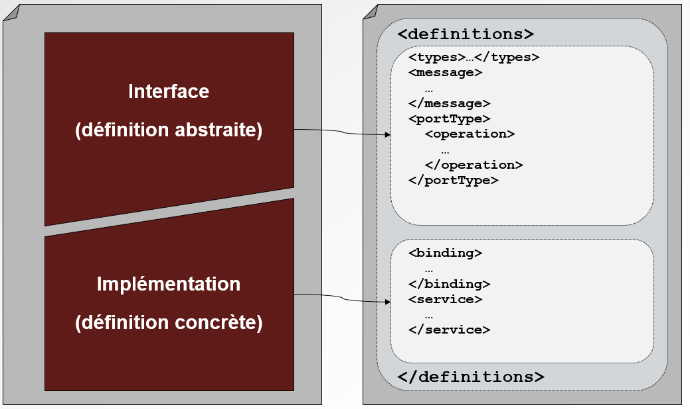

Notes :


## WSDL : définition abstraite/concrète

- Définition abstraite (ou logique)
	- Contenu des messages (entrée/sortie)
	- Opérations possibles
		- Paramètres
		- Erreurs

		
Notes :


## WSDL : définition abstraite/concrète

- Définition concrète (ou physique)
	- Implémentation du service
		- Format des messages
		- Type de communication
	- Emplacement du service
		- Adresse réseau
Notes :


## Éléments WSDL : definitions(1/2)

- <definitions>
	- Racine du document
	- Définit le nom du service et sonnamespace
	- Peut contenir lesnamespacesutilisés par le service


```
<?xml version="1.0" encoding="UTF-8"?>
<definitions
name="VoyageService"
targetNamespace="http://ws.resanet.com/"
xmlns:soap="http://schemas.xmlsoap.org/wsdl/soap/"
xmlns:tns="http://ws.resanet.com/"
xmlns:xsd="http://www.w3.org/2001/XMLSchema"
xmlns="http://schemas.xmlsoap.org/wsdl/">
…
</definitions>

```

Notes :


## Éléments WSDL : types

- ```<types>```
	- Définition des types/éléments XSD
	- Possibilité d'importer des schémas XSD


```
<wsdl:types>
<xsd:schema
targetNamespace="http://ws.resanet.com/agence"
xmlns:xsd="http://www.w3.org/1999/XMLSchema">

<xsd:import
namespace="http://ws.resanet.com/voyages"
schemaLocation="voyages.xsd"/>
…
</xsd:schema>
</wsdl:types>

```

Notes :


## Éléments WSDL : messages

- ```<message>```
	- Définition des messages (entrée/sortie/erreur)
	- S'appuie sur les éléments/types des schémas XSD


```
<message>
<partname="parameters" element="tns:voyageService"/>
</message>
<message>
<partname="return" element="tns:voyageServiceResponse"/>
</message>
<message>
<partname="estDisponibleFault" element="tns:estDisponibleFault"/>
</message>
```

Notes :


## Éléments WSDL : portType

- ```<portType>```
	- PortType= Interface
	- Définit les opérations fournies par le service (<operation>)
	- Un message peut être composé de un ou plusieurs éléments/types


```
<portType name="VoyageService">
<operation name="operation1">
…
</operation>
<operation name="operation2">
…
</operation>
</portType>
```

Notes :


## Éléments WSDL : les opérations

- WSDL 1.1 définit 4 types d'opérations

- Chaque type d'opération est défini par un MEP

- MEP :Message Exchange Pattern

- MEP disponibles
	- One-Way
	- Request-Response
	- Solicit-Response
	- Notification

Notes :


## Request-Response

- L'opération reçoit une requête (input) et envoie une réponse (output) ou une erreur (fault)

- Type d'opération le plus courant

- Paramètres
	- input (obligatoire) : requête
	- output (obligatoire) : réponse
	- fault (optionnel) : erreur

Notes :


## One-Way

- L'opération reçoit une requête (input) ; aucune réponse n'est renvoyée à l'appelant

- Paramètres
	- input (obligatoire) : requête

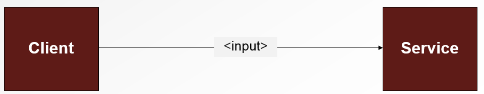	
	
Notes :


## Request-Response / One-way

```
<?xml version="1.0" encoding="UTF-8"?>
<definitions …>
  …
  <portType name="VoyageService">

    <operation name="estDisponible">
      <input message="tns:voyage"/>
      <output message="tns:disponibilite"/>
      <fault name="fault" message="tns:estDisponibleFault"/>
    </operation>
	
    <operation name="commander">
      <input message="tns:commande"/>
    </operation>

  </portType>
  …
</definitions>

```

Notes :


## Solicit-Response et Notification (1/2)

- Solicit-Response

<figure>
    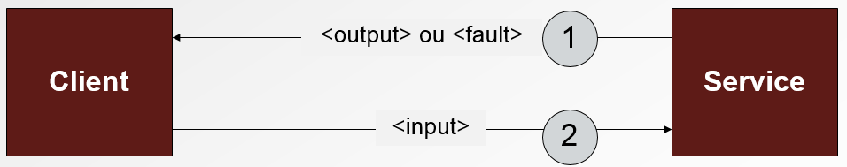
</figure>

- Notification

<figure>
    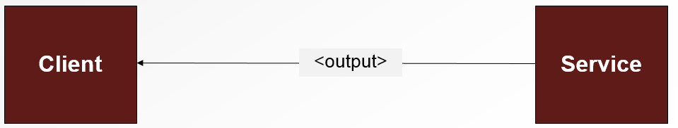
</figure>

Notes :


## Solicit-Response et Notification (2/2)

- Le Web Service est à l'initiative de la requête
	- Nécessite l'envoi initial d'une adresse de callback client
	- Le principe de callback n'a jamais été standardisé pour ces MEP

- Opérations interdites par le WS-I Basic Profile


```
R2303 - A DESCRIPTION MUST NOT use Solicit-Response and 
Notification type operations in a wsdl:portTypedefinition.
```

- Types d'opérations rarement implémentés
	- Non pris en charge par CXF

Notes :


## Éléments WSDL : binding

- ```<binding>```
	- Relie unportType(ie. description abstraite) à des technologies spécifiques de communication
	- Permet au consommateur de savoir comment appeler le service


```
<wsdl:binding
name="VoyageServiceImplServiceSoapBinding"
type="tns:VoyageService">
<soap:binding
style="document"
transport="http://schemas.xmlsoap.org/soap/http" />
<wsdl:operation name="estDisponible">
…
</wsdl:operation>
</wsdl:binding>

```

Notes :


## Binding SOAP Document/Literal via HTTP

```
<binding
name="voyage_doc_soap11"
type="tns:voyageServicePT">
<soap:binding
style="document"
transport="http://schemas.xmlsoap.org/soap/http" />
<operationname="estDisponible">
<soap:operation soapAction="" />
<input>
<soap:body use="literal" />
</input>
<output><soap:body use="literal" /></output>
<fault name="fault">
<soap:fault name="fault" use="literal" />
</fault>
</operation>
…
</binding>

```

Notes :


## Le choix du binding

- Deux types de binding sont couramment utilisés

- RPC/Literal
	- Le nom de l'opération est stockée directement dans le Body du message
	- La validation des données est difficile


Notes :


## Le choix du binding
	
- Document/Literal
	- les <message>sont stockés directement dans le Body du message SOAP → la validation est simple
	- Le nom de l'opération appelée n'est pas disponible

- Remarque sur l'encodage Literal: l'encodage des requêtes/réponses s'appuie uniquement sur les schémas XSD (contrairement à SOAP/encoded)


Notes :


## Requête RPC/Literal

-WSDL

```
<message name="requete">
	<partname="x" type="xsd:int"/>
	<partname="y" type="xsd:int"/>
</message>
	<message name="void"/>
	<portType name="portType">
	<operation name="methode">
		<input message="requete"/>
		<output message="void"/>
	</operation>
</portType>
```

-SOAP

```
<soap:envelope><soap:body>
	<methode>
		<x>5</x><y>5</y>
	</methode>
</soap:body></soap:envelope>
```

Notes :


## Requête Document/Literal
-WSDL

```
<types>
	<schema>
	<element name="xElement" type="xsd:int"/>
	<element name="yElement" type="xsd:int"/>
	</schema>
</types>
<message name="requete">
	<partname="x" element="xElement"/>
	<partname="y" element="yElement"/>
</message> 
<message name="void"/> 
<portType name="portType">
	<operation name="methode">
	<input message="requete"/>
	<output message="void"/>
	</operation>
</portType>
```

Notes :


## Requête Document/Literal

-SOAP

```
<soap:envelope>
<soap:body>
<xElement>5</xElement>
<yElement>5</yElement>
</soap:body></soap:envelope>
```

Notes :


## Binding : les bonnes pratiques

- Document/Literal « Wrapped »: standard de facto dans le monde des Web Services → permet de bénéficier des avantages respectifs de RPC et de Document

- Document/Literal « Wrapped » = Document/Literal + conventions de typage/nommage

Notes :


## Binding : les bonnes pratiques

- Conventions « Wrapped »
	- Message d'entrée
		- Un *part* est défini
		- Le *part* est un élément
		- L'élément prend le même nom que l'opération
	- Message de sortie
		- L'élément respecte les mêmes conventions mis à part pour le nom qui prend le nom de l'opération suffixé par « Response » (exemple : reserver → reserverResponse)

Notes :


## Requête Document/Literal « Wrapped » (1/2)
```
<xs:schema elementFormDefault="unqualified" targetNamespace="http://ws.resanet.com/voyages"
version="1.0" xmlns:tns="http://ws.resanet.com/voyages"
xmlns:xs="http://www.w3.org/2001/XMLSchema">
	<xs:element name="estDisponible">
	<xs:complexType>
		<xs:sequence>
			<xs:element name="depart"type="xs:string"/>
			<xs:element name="arrivee"type="xs:string"/>
			<xs:element name="date"type="xs:dateTime"/>
		</xs:sequence>
	</xs:complexType>
	</xs:element>
	<xs:element name="estDisponibleResponse">
...
</xs:schema>
```
Notes :


## Requête Document/Literal « Wrapped » (2/2)

```
<Envelope xmlns="http://schemas.xmlsoap.org/soap/envelope/" 
xmlns:voy="http://ws.resanet.com/voyages">
<Body>
	<voy:estDisponible>
		<voy:depart>Paris</voy:depart>
		<voy:arrivee>Rennes</voy:arrivee>
		<voy:date>2009-07-31</voy:date>
	</voy:estDisponible>
</Body>
</Envelope>
```

Notes :


## Éléments WSDL : service

- ```<service>```
	- Spécifie l'emplacement du service (ie. endpoint)
	- Il est possible de spécifier l'adresse correspondante à chaque binding

- Exemple

```
<service name="voyageService">
<port
name="voyageServicePort"
binding="tns:voyage_doc_soap11">
<soap:address
location="http://localhost:8080/voyages" />
</port>
</service>
```

Notes :


## Étapes de création d'un WS en Contract-First

- Créer un WSDL

- Générer le code JAX-WS à partir du WSDL

- Implémenter le Web Service à partir du code généré

- Déployer le Web Service

Notes :


## Génération Java à partir du WSDL

- CXF fournit l'outil wsdl2java afin de générer les classes Java à partir d'un fichier WSDL

- Exemple

```
> wsdl2java -p com.resanet.ws -impl -d <destination> voyages.wsdl

Nom du package des classes Implémentation du service

```


Notes :


## Génération Java à partir du WSDL

- L'outil wsdl2java génère
	- L'ensemble des classes JAXB
	- L'interface du service (nom de le classe = nom duportType)
	- Une implémentation du service à compléter (nom de le classe = nom du portType + « Impl »)
	- Une classe cliente (nom de le classe = nom duservice)

Notes :


## SEI

```
@WebService(targetNamespace ="http://ws.resanet.com", 
name ="voyagePortType")
@XmlSeeAlso({ObjectFactory.class})

public interface VoyagePortType {

@RequestWrapper(localName ="estDisponible", 
targetNamespace ="http://ws.resanet.com", className ="com.resanet.ws.EstDisponible")
@ResponseWrapper(localName ="estDisponibleResponse", targetNamespace ="http://ws.resanet.com", 
className ="com.resanet.ws.EstDisponibleResponse")
@WebResult(name ="disponible", targetNamespace ="http://ws.resanet.com")
@WebMethod

public boolean estDisponible(@WebParam(name ="ref", targetNamespace ="http://ws.resanet.com")String ref);

}
```

Notes :


## Implémentation du service

```
@WebService(
targetNamespace ="http://ws.resanet.com",
serviceName ="voyageService",
portName ="voyageServicePort",
wsdlLocation ="wsdl/voyages.wsdl",
endpointInterface ="com.resanet.ws.VoyagePortType")

public class VoyagePortTypeImpl implements VoyagePortType {
public boolean estDisponible() {…}
}
```


Notes :


## Implémentation du service

- L'implémentation du service est un POJO annoté avec @WebService (ie. comme le SEI)

- Il est possible de créer le squelette de l'implémentation via le paramètre *-impl* de wsdl2java


Notes :


## Comparaison Code-First/Contract-First

- Code-First
	- Est facile et rapide à mettre en œuvre pour des cas simples (ie. XML basique)
	- Devient plus complexe et long à mettre en œuvre sur des services manipulant des données structurées
	- contrat (ie. WSDL) difficile à maîtriser→peut poser des problèmes d'interopérabilité

- Contract-First
	- Nécessite de maîtriser WSDL et XSD
	- Plus long à mettre en œuvre
	- Garantit l'interopérabilité du service

- Il est fortement conseillé de développer en *Contract-First*

Notes :


# Déploiement Serveur

<!-- .slide: class="page-title" -->

Notes :


## Déployer des Web Services en production

- En production, il est important dene pasmettre en œuvre un déploiement standalone (ie.Endpoint.publish)
	- Robustesse
	- Performances
	- Monitoring
	- Scalabilité
- Il est nécessaire de s'appuyer sur des conteneurs dédiés
	- Conteneur/Serveur JEE
	- Moteur OSGi

Notes :


## Déployer CXF dans un conteneur JavaEE


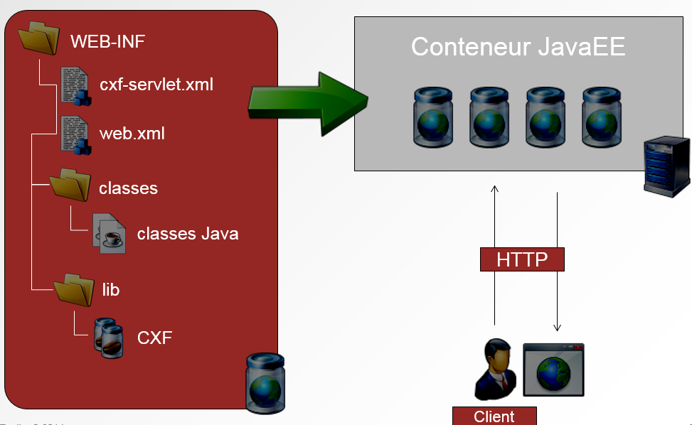


Notes :


## Créer une application CXF sous Eclipse (1/7)

- Créer une application Web
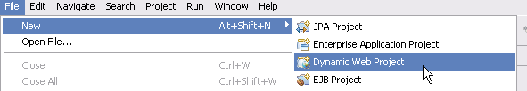


Notes :


## Créer une application CXF sous Eclipse (2/7)

- Associer l'application Web à un conteneur/serveur JEE

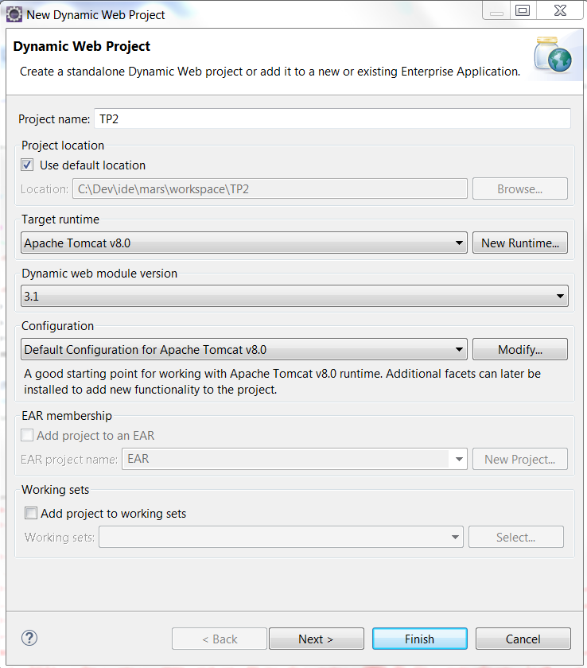

Notes :


## Créer une application CXF sous Eclipse (3/7)

- Associer l'ensemble des bibliothèques CXF et leurs dépendances
- Configurer l'application
	- web.xml
	- cxf-servlet.xml

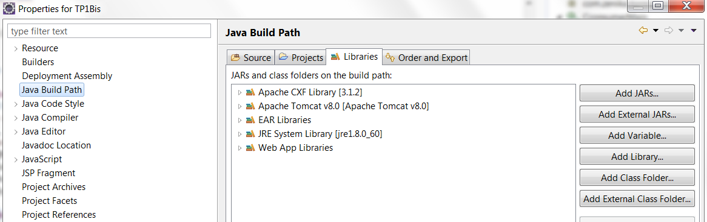

Notes :


## Créer une application CXF sous Eclipse (4/7)

- web.xml: Déclaration du point d'entrée des Web Services (ie. Servlet)

```
<?xmlversion="1.0"encoding="UTF-8"?>
<web-app version="3.0" xmlns="http://java.sun.com/xml/ns/javaee"
	xmlns:xsi="http://www.w3.org/2001/XMLSchema-instance"
	xsi:schemaLocation="http://java.sun.com/xml/ns/javaee 
				http://java.sun.com/xml/ns/javaee/web-app_3_0.xsd">
		<display-name>cxf</display-name>
	<servlet>
		<servlet-name>cxf</servlet-name>
		<servlet-class>org.apache.cxf.transport.servlet.CXFServlet</servlet-class>
	</servlet>
	<servlet-mapping>
		<servlet-name>cxf</servlet-name>
		<url-pattern>/services/*</url-pattern>
	</servlet-mapping>
</web-app>
```

Notes :


## Créer une application CXF sous Eclipse (4/6)

- cxf-servlet.xml: Déclaration des endpoints Web Services


```
<beans xmlns="http://www.springframework.org/schema/beans" 
	xmlns:xsi="http://www.w3.org/2001/XMLSchema-instance"
	xmlns:jaxrs="http://cxf.apache.org/jaxrs"
	xsi:schemaLocation="http://www.springframework.org/schema/beans 
	http://www.springframework.org/schema/beans/spring-beans.xsd
	http://cxf.apache.org/jaxrs
	http://cxf.apache.org/schemas/jaxrs.xsd">
	
	<jaxrs:serverid="resanetService" address="/resanet" 
		serviceClass="com.resanet.ws.VoyageService"/>
</beans>
```

Notes :


## Créer une application CXF sous Eclipse (6/6)

- Développer les Web Services

- Déployer l'application sur le serveur cible
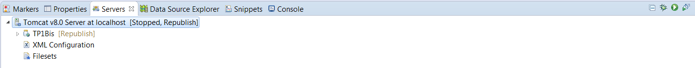

- Démarrer le serveur
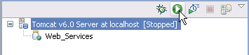

- Accéder au Web Service via l'adresse du WADL
http://localhost:8080/[NOM_PROJET]/services/[ENDPOINT_WS]?wadl


Notes :


<!-- .slide: class="page-questions" -->


<!-- .slide: class="page-tp2" -->


# WebServices  REST


<!-- .slide: class="page-title" -->


Notes :


## La naissance de REST

- Terme inventé par Roy Fielding en 2000 pour sa thèse

- Part du constat que le WEB est partout, performant et scalable

- Comment amener ces principes dans une architecture d'application ?

- Principalement grâce au protocole HTTP

- Créer un principe qui s'appuie sur les mêmes outils

Notes :


## REST

- REST est un type d'architecture
	- S'appuyant sur les principes fondateurs du web
	- Orientée Ressources

- REST n'est pas
	- Un protocole
	- Une technologie

- REST =REpresentationalStateTransfer

Notes :


## Principes REST (1/5)

- Adressabilité

- Tout est une ressource

- Chaque ressource possède un identifiant unique
	- *scheme://host:port/path?queryString#fragment*
		
- Définit une adresse unique sur le réseau (URI)

- L'adresse est paramétrable

- Il est primordial de bien définir les URIs


Notes :


## Principes REST (2/5)

- Interface uniforme

- REST utilise 4 opérations pour manipuler les ressources

- Une API restreinte mais suffisante

- L'interopérabilité est facilitée : API connue et maîtrisée

- Les opérations ont un comportement prévisible

Notes :


## Principes REST (3/5)

- Représentation

- Une ressource peut être représentée par plusieurs formats de données
	- XML
	- JSON
	- YAML
	- autres...

- Le meilleur format est celui qui est le plus adapté au client

- Le client peut négocier la représentation des données avec le serveur.

Notes :


## Principes REST (4/5)

- *Stateless*

- Stateless ne veut pas dire qu'il n'y pas d'état

- L'état est porté par la ressource, pas par le serveur

- Les actions sont répétables et prévisibles

- Pas de session coté serveur, donc pas de réplication

- Le client est responsable de la session et des transitions

Notes :


## Principes REST (5/5)

- HATEOAS

- *H*ypermedia *A*s *T*he *E*ngine *O*f *A*pplication*S*tate

- Fournir des liens pour naviguer entre les états d'une ressource

- Pour le client, cela permet de découpler une action d'une implémentation

- Le client reçoit une liste de transitions possibles

Notes :


## Actions

- CRUD
	- Create / PUT
	- Read / GET
	- Update / POST
	- Delete / DELETE

- Suffisant pour stocker et/ou gérer les états d'une ressource

Notes :


## RESTful

- Ce dit d'une application qui respecte l'ensemble des principes REST

- Pas toujours facile à respecter, la conception est déterminante

- REST n'est pas forcément RESTful

- Attention aux écueils de trop vouloir appliquer la règle !

- Il n'est pas toujours souhaitable d'appliquer la règle à la lettre
	- Des compromis peuvent être salutaires...
 
Notes :


## En pratique

- Utiliser l'API sans se soucier de l'implémentation
- Package *javax.ws.rs*
- Configuration des beans avec des annotations
- Sérialisation automatique, personnalisable, extensible
- Utilitaire pour construire la réponse : ResponseBuilder

Notes :


## Le service

- Exemple : Gestion de livres
- URI principale de la ressource : /books
- Commandes :
	- Lister tous les livres
	- Trouver un livre
	- Ajouter un livre
	- Modifier un livre
	- Supprimer un livre

Notes :


## En pratique

- Une ressource = un POJO JAVA
- Endpoint = Une classe JAVA qui délègue au manager
- Convention : BookResource = Classe qui gère la ressource
- @Path ("/path")
	- Sur la classe : définit l'URI de base des commandes
	- Sur une méthode : ajoute à l'URI de base la localisation / paramétrage de la commande

````
@Path("/books")
public class BookResource {
}
````

Notes :


## Objets de retour

- 2 possibilités
	- Un objet du modèle ou une collection
````
@GET
public Collection<Voyage> list() {
return library.list();
}
````
	- L'objet Response	
````
@GET
public Response list() {
return Response.ok(library.list()).build();
}
````

- Permet de manipuler les headers HTTP, code de retour,
	
Notes :


## Lister tous les livres

- URI : GET /books HTTP 1.1

````
@GET
public Response list() {
return Response.ok(library.list()).build();
}
````
Notes :


## Lister tous les livres

- HTTP Response 200

````
<livres>
<livre>
<auteur>Albert Camus</auteur>
<isbn>2070360024</isbn>
<titre>L'étranger</titre>
</livre>
<livre>
<auteur>RobertLouisStevenson</auteur>
<isbn>2253003689</isbn>
<titre>L'îleautrésor</titre>
</livre>
</livres>
````

Notes :


## Trouver un livre

- URI : GET /books/2070360024 HTTP/1.1

````
@GET
@Path("/{isbn}")
public Response findByISBN(@PathParam("isbn") String isbn) {
returnResponse.ok(library.find(isbn)).build();
}
````
- HTTP Response : 200 OK

````
<livre>
	<auteur>AlbertCamus</auteur>
	<isbn>2070360024</isbn>
	<titre>L'étranger</titre>
</livre>
````

Notes :


## Ajouter un livre

- URI : POST /books

````
POST /books HTTP/1.1
Content-Type: application/xml;charset=UTF-8

<livre>
	<auteur>Albert Camus</auteur>
	<titre>L'étranger</titre>
</livre>
````

````
@POST
public Response create(final Book book) {
returnResponse.created(library.create(book)).build();
}
````

````
HTTP Response : 201 Created
Location: http://api.zenika.com/books/2070360024
````

Notes :


## Modifier un livre

- URI : /books/2070360024

````
HTTP/1.1
Content-Type: application/xml;charset=UTF-8
<livre>
	<auteur>Albert Camus</auteur>
	<isbn>2070360024</isbn>
	<titre>L'étranger(VO)</titre>
</livre>
````

````
@PUT
public Response update(final Book book) {
library.update(book) ;
return Response.noContent().build();
}
````

````
HTTP Response : 204 No Content
````
Notes :


## Supprimer un livre

- URI : DELETE /books/2070360024 HTTP/1.1

````
@DELETE
@Path("/{isbn}")
public Response delete(final @PathParam("isbn") String isbn){
library.delete(isbn);
return Response.noContent().build();
}
````

````
HTTP Response : 204 No Content
````

Notes :


<!-- .slide: class="page-questions" -->


<!-- .slide: class="page-tp3" -->