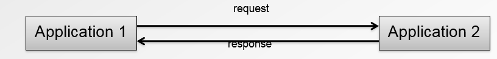
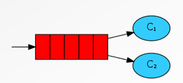

#Messages Oriented Middleware

<!-- .slide: class="page-title" -->

Notes :


## Contenu

- L’API JMS

- Le standard AMQP

- Messaging AMQP / JMS

- L’approche Message-Driven (ou Event-Driven)

- Transaction, intégrité et fiabibilité


Notes :


## Les MOM

- Les MOM peuvent véhiculer n’importe quel type de messages
	- Texte
		- XML
		- String
	- Binaire
		- Objet
		- Byte

- Les messages contiennent des headers
	- Métiers
	- Techniques


Notes :


## Synchrone VS Asynchrone

- Echange synchrone (non supporté sur les MOM nativement



- Echange asynchrone


Notes :


## Messaging et couplage

- Producer
	- Celui qui produit le message

- Consumer
	- Celui qui consomme le message

- Les brokers découplent totalement les producers des consumers
	- Pas besoin d’être côté à côté
	- Pas besoin d’une réponse immédiate (potentiellement jamais)
	- Ils ne se connaissent pas
	- N’ont pas besoin d’être implémenter avec la même technologie (Java, Cobol)


Notes :


<!-- .slide: class="page-tp4" -->


#JMS

<!-- .slide: class="page-title" -->

Notes :


## L’API JMS (Java Message Service)

- JMS est une API JAVA
	- Ensemble d’interfaces
	- Ensemble de principes de fonctionnement du MOM

- Définition standard Java et abstraction du broker de messages
	- Très pratique pour changer d’implémentation / driver JMS


Notes :


## Principes JMS

- Les messages sont stockés sur des files de messages
	- Queue
	- Topic

- La queue
	- Un seul consommateur reçoit le message

- Le topic (publish / subscribe)
	- Tous les consommateurs connectés reçoivent une copie du message

Notes :


## L’API JMS (Java Message Service)

- JMS est une API JAVA
	- Ensemble d’interfaces

- Définition standard Java et abstraction du broker de messages
	- Très pratique pour changer d’implémentation / driver JMS

- Elle spécifie au niveau développement les conventions d’accès
	- Au broker
	- Au message
	- À la connexion


Notes :


## L’API JMS (Java Message Service)

-Version Old School


Notes :


## Envoi d’un message JMS

- Récupération d’une ConnectionFactory JMS
	- Générallement via un lookup ou bean Spring	
```
@Resource
private ConnectionFactory cf;
```

- Récupération de la queue / topic
	- Générallement via un lookup ou bean Spring
	- Création et établissement d’une connection

```
@Resource
private Destination destination;
```

```
Connection connection=cf.createConnection();
connection.start();
```


Notes :


## Envoi d’un message JMS

```
Session producerSession = 
connection.createSession(true, Session.SESSION_TRANSACTED);
	
MessageProducer producer = 
producerSession.createProducer(destination);
	
Message message = producerSession.createTextMessage("Requete");

producer.send(message);

producerSession.commit();

producerSession.close();

connection.close();

```

Notes :


## Réception d’un message JMS


```
Session receiverSession = 
connection.createSession(true, Session.AUTO_ACKNOWLEDGE);

MessageConsumer consumer = 
receiverSession.createConsumer(autreDestination);

Message received = consumer.receive(5000);


// business here !

receiverSession.commit();

receiverSession.close();

connection.close();

```

Notes :


<!-- .slide: class="page-questions" -->


<!-- .slide: class="page-tp5" -->


# AMQP

<!-- .slide: class="page-title" -->


Notes :


## Les standards des MOM

- Jusqu’en 2012 (!), aucun standard pour les MOM
	- Il existait bien JMS, mais ce n’est pas un standard

Notes :


## AMQP – Advanced Message Queuing Protocol

- En 2012 est sorti la version 1.0 du standard AMQP

- Pourquoi AMQP ?
	- Besoin d’intégrer des systèmes hétérogènes avec les propriétés des MOM
	- Se baser sur un protocole standard et ouvert
	- Le langage et l’implémentation n’importe pas


Notes :


## Positionnement

||unreliable|reliable|
|-|--|-------|
|asynchrone| SMTP| ?|
|synchrone| HTTP|IIOP|


Notes :


## AMQP – Advanced Message Queuing Protocol

- AMQP != JMS


Notes :


#RabbitMQ – Broker AMQP performant

<!-- .slide: class="page-title" -->

Notes :


## RabbitMQ – Broker AMQP performant


- Broker de messages multi-protocoles
	- AMQP, SMTP, STOMP, XMPP, etc.

- Construit autour du protocole AMQP

- Des « bindings » dans la plupart des langages
	- Java, .NET, Python, JavaScript, Ruby, PHP, etc.

Notes :


## Le fonctionnement d'AMQP


	
Notes :


## Le fonctionnement d'AMQP

- Queue
	- Les messages sont consommés à partir desqueues
	- Les messages sont stockés dans lesqueues
	- Les queues sont FIFO

- Exchange
	- Les messages ne sont pas directement envoyés sur lesqueues
	- Ils sont routés vers lesqueuesau travers des exchanges

- Binding
	- Les queues sont connectées aux exchanges grâce aux bindings
	- Les bindings se font grâce à des patterns
	
Notes :


## Le fonctionnement d'AMQP

- Consumer
	- Les consumers sont directement connectés aux queues
	- Plusieurs consumers peuvent être connectés à la même queue
		- Dans ce cas, le message n'est délivré qu'à un seul consumer
		- Le mode de dispatch est round-robin



Notes :


## Le fonctionnement d'AMQP

- Producer
	- Les producers ne sont pas connectés auqueue
	- Ils sont connectés auxexchanges
	- Plusieurs producers peuvent être connectés au même exchange


Notes :


## Le fonctionnement d'AMQP

- Le routage
	- Les messages sont publiés avec une routing-key
	- Les messages sont routés jusqu'aux queues par matching entre la routing-key et les patterns des bindings


Notes :


## Le fonctionnement d'AMQP

- Les différents types d'Exchange
	- fanout
		- Pas de pattern, pas de routing-key, le lien est direct
	- direct
	- le pattern du binding est simplement le nom de la queue
	- topic
		- le pattern du binding est une expression qui vérifie le nom de la queue (pattern matching)
	- headers
		- Pattern appliqué sur un header défini

Notes :


## Le fonctionnement d'AMQP

- Attention
	- Le topic en AMQP n'est pas un publish / subscribe !
	- Uniquement un type de routage

- Pour faire un mode pub/sub en AMQP
	- Chaque consumer doit avoir sa propre queue

Notes :


## Envoyer un message AMQP

- Il n’y pas d’API autour d’AMQP, les codes sont donc dépendants des implémentations et des API des drivers des brokers

- Création de la connexion AMQP vers le broker RabbitMQ

```
ConnectionFactory factory=newConnectionFactory();
factory.setUsername("guest");
factory.setPassword("guest");
factory.setVirtualHost("/");
factory.setHost("localhost");
factory.setPort(5672);
Connection connection=factory.newConnection();
```

Notes :


## Envoyer un message AMQP

- Création du channel et envoi du message

```
Channel channel=connection.createChannel();
byte[] message ="message".getBytes();
channel.basicPublish("quotations","nasq",null, message);
```

Notes :


## Recevoir un message AMQP

- Création du channel et récupération du message

```
GetResponse response=channel.basicGet("queueName",true);
```

Notes :


# Message Driven


<!-- .slide: class="page-title" -->

Notes :


## Message Driven

- Jusqu’à présent, nous avons vu uniquement des consommateurs « actifs », qui sont en attente de réception de message bloquante

- Il est évidemment possible de réaliser une attente de façon asynchrone, et d’être notifié lorsqu’un message arrive sur la queue.

Notes :


## JMS Message Driven

- Réception asynchrone JMS

- Une instance (ou n instances) est ensuite enregistré sur la connexion, et peu ainsi être notifié de façon totalement asynchrone

- Peut aussi être enregistré dans le contexte Spring

```
import javax.jms.Message;
import javax.jms.MessageListener;

public class JMSMessageDriven implements MessageListener{

public void onMessage(Message message){
// businesshere
}
}
```
Notes :


## AMQP Message Driven – via Spring AMQP

- Réception asynchrone AMQP (Spring AMQP)

- Uniquement les imports Java changent (abstraction sur le broker)

```
import org.springframework.amqp.core.Message;
import org.springframework.amqp.core.MessageListener;

public class AMQPMessageDriven implements MessageListener{

public void onMessage(Message message){
// businesshere
}
}
```

Notes :


# Transactions


<!-- .slide: class="page-title" -->

Notes :


## Les transactions MOM

- Il est également possible de grouper des messages dans une même transactions
	- Plusieurs messages en mode consumer
	- Plusieurs messages en mode producer
	- Un mélange des deux !

```
Grâce aux transactions des MOM, on peut donc très simplement 
assurer une intégrité totale et une très grande fiabilité 
des traitements.

->Les traitements critiques sont très souvent placés 
entre 1 paire de files.
```

Notes :


## Les transactions MOM

- Une des plus grandes forces des MOM est d’être transactionnel

- Au mettre titre que les opérations sur les bases de données, les opérations faites sur les brokers peuvent faire l’object d’un :
	- Commit (validation)/Rollback (annulation)

- On peut donc par exemple :
	- Lire un message sur une file en mode transactionnel
	- Faire un traitement
	- Puis finalement commiter le message

```
Si un erreur survient lors du traitement, 
le message non commité sera automatiquement remis sur la file
```

Notes :


## AMQP – Acknowledgement / Transaction

- En AMQP, on parle plus d’Acknowledgement plutôt que de transaction, bien que les 2 existent

- Le système d’acknwoledgement est plus souple et permet de grouper plusieurs messages ensemble (émission ou réception)

- Le système de transaction est utilisé lorsque l’on souhaite coupler dans la même transaction la réception et l’émission.

Notes :


## AMQP - ACK

- Acknowledgement d’un message seul

```
boolean autoAck=false;
GetResponseresponse =channel.basicGet("queueName",autoAck);

if(response !=null) {
AMQP.BasicProperties props =response.getProps();
byte[] body =response.getBody();
long deliveryTag=response.getEnvelope().getDeliveryTag();

// do business logic here

boolean multiple =false;
channel.basicAck(deliveryTag, multiple);

}
```

Notes :


## AMQP - ACK

- Acknowledgement d’un groupe de messages

```
boolean autoAck=false;
GetResponseresponse1 =channel.basicGet("queueName",autoAck);

// do business with response1
GetResponseresponse2 =channel.basicGet("queueName",autoAck);

// do business with response2
GetResponseresponse3 =channel.basicGet("queueName",autoAck);

// do business with response3
long latestDeliveryTag= response3.getEnvelope().getDeliveryTag();
channel.basicAck(latestDeliveryTag,true);
```


Notes :


## AMQP - ACK

- Tous les messages qui
	- Sont reçus sur le même channel
	- Pas encore reçu d’acknowledge
	- Avec un DeliveryTag inférieur ou égal au DeliveryTag passé à la méthode basicAck()

<figure>
    
</figure>
<figure>
    
</figure>


Notes :


<!-- .slide: class="page-questions" -->


## Tp Bonus


