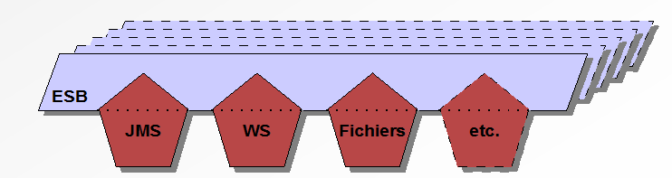
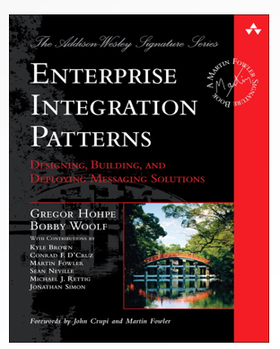

#ESB

<!-- .slide: class="page-title" -->


Notes :


## Contenu

- Comprendre l’utilité ESB

- Les EIP – Entreprise Integration Patterns

- La connectivité

- Le routage des messages

- Les transformations

Notes :


## Communication entre des systèmes

- Les applications d'entreprise sont dispersées (géographiquement et logiquement)

- Les applications isolées sont inutiles

- Elles doivent communiquer entres elles par nécessité

- Il faut éviter « l'architecture accidentelle »

<figure>
    
</figure>

Notes :


## Communication entre des systèmes

- L'ESB permet d'adresser cette problématique

<figure>
    
</figure>


Notes :


## Couplage lâche (interactions)

- Lecouplage lâche, aussi appelé couplage faible ou léger (loose coupling), se dit d'une interaction entre des composants logiciels où les parties se concentrent uniquement sur la production du message à transmettre
	- exemples : JMS, Webservices, Fichiers

- A l'inverse, dans une interaction àcouplage fort, les parties connaissent intimement les détails de l'interface à appeler
	- exemples : RPC, RMI

Notes :


## Couplage lâche (interactions)

- Les ESB nous permettent de découpler les applications en fournissant une couche d'abstraction

- Les échanges de messages ne se font plus directement entre applications, c'est désormais l'ESB qui fait le médiateur

<figure>
    
</figure>

- Du « plat de spaghetti » versl'intégration d'un ESB

Notes :


## Distributivité

- L'ESB est hautement distribué par définition

- Ne pas reproduire les erreurs des EAI (centralisé et monolithique)

<figure>
    
</figure>


Notes :


## Distributivité

- La distributivité apporte
	- Scalabilité (ajout de nœuds)
	- Fiabilité (failover, load-balancing)
	- Facilité d'intégration (« si vous ne pouvez pas amener l'application au bus, amenez le bus à l'application »)

Notes :


## Connectivité

- Les applications se comprennent rarement entre-elles

- Une multitude de technologies / protocoles différents utilisés par les applications d'entreprise
	- JMS, Webservices, SMTP, Fichiers, JDBC, EJB, etc.

<figure>
    
</figure>	
	
- Relier des protocoles et des applications hétérogènes

- Intégration de nouvelles applications facilitée

Notes :


## Connectivité

- L'ESB est capable de faire communiquer des applications utilisant des protocoles différents via les adaptateurs (ou connecteurs)

- Extensibilité
	- Installation d'adaptateurs tiers
	- Création d'adaptateurs spécifiques



Notes :


## Transformation et enrichissement

- Transformation
	- Les applications ne travaillent pas avec un format commun
	- Convertir un message initial vers un format cible
	- Transformation de données
	- XSLT (eXtensible Stylesheet Language Transformation)

<figure>
    
</figure>	

Notes :


## Transformation et enrichissement

- Enrichissement
	- Les messages qui transitent ne contiennent pas toutes les données utiles
	- Ajouter des données au message
	- Collecte de données d'un système tiers (JDBC, Webservices, etc.)

	
<figure>
    
</figure>	

Notes :


## Routage

- Logique métier qui détermine la destination finale du message

- Acheminer le message en fonction de critères métiers

- Aiguillage intelligent

- Possibilité de router le message vers plusieurs applications en parallèle ou de façon séquentiel

<figure>
    
</figure>	

Notes :


## intégrité

- Un ESB doit être fiable
- Utilisation d'un serveur de messages intrinsèque
- Application du pattern «send and forget»
- L'ESB garantit que le message arrivera à destination
- Système de gestion d'erreurs

<figure style="position: absolute; bottom: 320px; right: 10px;">
    
</figure>

Notes :


## Sécurité

- L'ESB est au cœur du SI, il est donc capital de le protéger
- Gestion des autorisations via de l'authentification
- Sécuriser les échanges entres applications
- Sécuriser les accès des utilisateurs
	
	

<figure style="position: absolute; bottom: 50px; right: 10px;">
    
</figure>	

Notes :


# Entreprise Integration Patterns

<!-- .slide: class="page-title" -->


Notes :


## Présentation des EIP

- Entreprise Integration Pattern
	- Auteurs *Gregor Hohpe* & *Bobby Woolf*
	- Design Pattern communs pour
	- résoudre des problèmes connus
	- Réponse aux problématiques
	- d'intégration des applications
	- Architecture orientée messages


<figure style="position: absolute; bottom: 300px; right: 5px;">
    
</figure>	

<figure style="position: absolute; bottom: 50px; right: 400px;">
    
</figure>	


Notes :


## EIP en clair ?

- Chaque EIP répond à un besoin particulier

- Vocabulaire :
	- « La succession d'EIP définit une Route entre 2 Endpoints( un producteur et un consommateur) »

- La composition des EIP entre eux permet de faire émerger de nouveaux Patterns

- Les 50 EIP permettent de modéliser des solutions à l'ensemble des problématiques d'intégration au travers d'un langage graphique commun

Notes :


## Introduction aux EIP de routage

- Les Entreprise Integration Patterns relatifs au routage
	- Routeurs simples
		- 1 canal d'entrée
		- N canaux de sorties
		- Routage simple
	- Routeurs composés
		- Combinaison de plusieurs routeurs simples
		- Création de routeurs complexes
		- Flux de messages complexes

Notes :


## Le Routage

- Un des plus gros défi pour un ESB est le routage
	- Quelle est la destination finale du message ?
	- Comment acheminer le message à sa destination finale ?
	- Sur quels critères se baser ?

- La destination est un Endpoint (qui peut être associée à un Service et à une interface)
	- Endpoint physique (fichier, webservices, file JMS)
	- Endpoint logique (direct:destination, endpoint interne JBI)

Notes :


## Introduction aux EIP de routage

- Aparté sur les EIP relatifs à la transmission de messages
	- Filters (au sens architectural)
		- Composant qui s'interface entre 2 Pipes
		- Ne rempli pas obligatoirement le rôle le filtre
	- Pipes
		- Lien entre 2 ou n composants
		- Peut avoir plusieurs modes de fonctionnement (pipeline, multicast)

Notes :


## Introduction aux EIP de routage


Notes :


## Les EIP – Routage de messages

- Fonctionnalités des EIP dédiés au routage de messages
	- Routage basé sur le contenu
	- Filtrage de messages
	- Construire dynamiquement la liste des destinataires
	- Segmenter des messages ennparties

Notes :


## Les EIP – Routage de messages

- 
	- Agréger n messages en un
	- Réordonner un groupe de messages
	- Processeur de messages composés
	- Dispersion – Ré-assemblage
	- Plan de routage
	- Gestion des processus métiers

Notes :


## Les EIP – Routage de messages

- Régulateur de débit
- Temporisateur
- Répartiteur de charge
- Diffusion versnrécepteurs
- Répétition

Notes :


## EIP – Content Based Router

- Content Based Router
	- Comment traiter une situation où l'implémentation d'une seule fonctionnalité est éparpillée sur plusieurs systèmes physiques ?

<figure>
    
</figure>		
	
- Routage basé sur le contenu

- Examine le contenu du message (headers ou body)
	- Existence de champs
	- Valeur de champs


Notes :


## EIP – Message Filter

- Message Filter
	- Comment éviter qu'un composant reçoive des messages qui ne l'intéressent pas ?

<figure>
    
</figure>	
	
- Filtre les messages pour n'en laisser passer que certains selon un ensemble de critères configurables

- Permet d'éviter de surcharger un système

- Épure les flux de messages

Notes :


## EIP – Recipient List

- Recipient List
	- Comment router un message vers une liste (statique ou dynamique) de destinataires ?

<figure>
    
</figure>	

Notes :


## EIP – Recipient List

- Recipient List
	- Deux axes dans cet EIP
		- Calculer la liste des destinataires
		- Router une copie du message entrant vers chacune des destinations
	- Les destinations sont calculées à partir du message d'entrée

Notes :


## EIP – Splitter

- Splitter
	- Comment traiter un message contenant plusieurs parties, chacune d'entre elles pouvant être traitées différemment?


Notes :


## EIP – Splitter

- Splitter
	- Casse le message d'origine en une série de messages individuels
	- Chaque nouveau message contient une parties des données d'origine
	- Lorsque couplé à un Content Based Router, permet de n'envoyer que les données utiles à un service
	- Il peut être intéressant de conserver un identifiant de corrélation entre les messages splittés

Notes :


## EIP – Aggregator

- Aggregator
	- Comment pouvons nous combiner des messages individuels (bien que liés) pour n'en former qu'un seul ?


Notes :


## EIP – Aggregator

- Aggregator
	- Combinaison des messages individuels pour ne former qu'un seul message
	- Collection des messages individuels
	- Stockage des messages individuels
	- Critères de liaisons des messages (identifiant de corrélation, header, valeur calculée)

Notes :


## EIP – Aggregator

- Aggregator
	- Critères de complétion de la collection
		- Quand publie-t-on le message résultant ?
		- Nombre de messages reçus
		- Délai d'attente
	- Algorithme d'agrégation
		- Comment réunit-on les messages entrants en un seul message ?

Notes :


## EIP – Aggregator

- 
	- EIP statefull
		- Stockage des messages individuels en attendant que l'intégralité des messages soit collectée

Notes :


## EIP – Resequencer

- Resequencer
	- Comment pouvons nous réordonner des messages ayant un lien mais arrivés aléatoirement ?


Notes :


## EIP – Resequencer

- Resequencer
	- Réception d'un flux de messages désordonnés
		- Selon un critère métier (ex :numéro de facture)
		- Selon un critère technique (ex : id de corrélation)
	- Rétention des messages dans un buffer interne (statefull)
	- Publication ordonnée des messages sur le channel de sortie (ce dernier se doit préserver l'ordre)
		- ex : une file JMS avec 1 seul consommateur
	- Comme les autre Routeurs, le Resequencer ne modifie pas (en général) le contenu des messages

Notes :


## EIP – Routing Slip

- Routing Slip
	- Comment pouvons nous router un message au travers d'une série de destinations, quand la séquence d'appels n'est pas connue à la conception et peut varier selon les messages entrants ?


Notes :


## EIP – Routing Slip

- Routing Slip
	- Routage dynamique, sans connaître les routes à la conception
	- Flux de messages efficace – Les messages sont envoyés uniquement aux destinations obligatoires, et les facultatives sont évitées
	- Gestion des ressources – Pas de grand nombre de channels, de routeurs
	- Flexibilité et maintenabilité – Les routes sont simples à changer et à mettre à jour

Notes :


## EIP – Process Manager

- Process Manager
	- Comment pouvons nous router un message au travers de plusieurs destinations, alors que les appels ne sont pas connus à la conception, et qu'ils ne sont pas séquentiels ?


Notes :


## EIP – Process Manager

- Process Manager
	- Utiliser une unité de traitement centrale
	- Maintenir de l'état courant (statefull)
	- Déterminer la prochaine étape dynamiquement
	- Véritable orchestrateur
	- Gestion des messages
	- Langage BPEL créer pour ce besoin
		- Business Process Execution Language

Notes :


## EIP – Process Manager

- Les outils de BPM qui supportent le langage BPEL sont de vrais logiciels à part entière
- Se tourner vers d'autres solutions
	- Oracle BPEL Process Manager
	- Apache ODE
	- Sun Open ESB
	- Autres solutions propriétaires

Notes :


# Un exemple d’ESB


<!-- .slide: class="page-title" -->


Notes :


## ServiceMix, ActiveMQ et Camel

- L'ESB est un ensemble de 3 principaux composants
	- Un conteneur de services léger
	- Un serveur de messages
	- Des services, des endpoints, des éléments de routage

- ServiceMix est un conteneur de service léger

- ActiveMQ est un serveur de messages compatible JMS/AMQP

- Camel est un framework d'intégration implémentant les EIP

- La réunion des trois éléments forme donc un ESB

Notes :


## Les avantages des ESB open source

- Un ESB open source doit avoir les caractéristiques suivantes
	- Licence (Apache, GPL)
	- Gratuit
	- Code source disponible et public

- Une communauté très présente et très réactive
	- + de 3000 mails/mois sur les mailing lists (SM, AMQ, CML)
	- Les commiters et mainteneurs impliqués directement

- Outil de suivi de bugs public (JIRA)

Notes :


## Apache ServiceMix

- Conteneur de services léger

- Conteneur OSGI

- ServiceMix contient

- Apache Felix / Eclipse Equinox

- Apache Karaf

- ServiceMix NMR

<figure style="position: absolute; bottom: 400px; right: 10px;">
    
</figure>	


Notes :


## Apache ServiceMix

- ServiceMix s'appuie maintenant principalement sur trois technologies
	- OSGi
		- Modularité
		- Classloading dynamique
	- Camel
		- Routage
		- Connectivité
	- CXF
		- Web Services

Notes :


## Apache ServiceMix : et JBI dans tout ça ?

- JBI 1.0
	- JBI 1.0 est toujours supporté
	- Les concepteurs de ServiceMix présente le support JBI avant tout comme une rétro-compatibilité

- ServiceMix 4 s'appuie sur le principe de « Lightweight ESB »
	- Camel (ou Spring Integration)
	- Approche POJO

- JBI 2.0
	- JSR-312 : Java Business Integration 2.0
	- Statut : « inactive »

Notes :


## Architecture ServiceMix 4
Apache Karaf


Notes :


## Apache ActiveMQ

- Serveur de messages

- Compatible spécifications JMS

- Performant et fiable (persistance KahaDB)

- Clustering / Haute Disponibilité
	- Master / Slave
	- Réseau de Brokers

- Supervision
	- Via la console
	- Via JMX


<figure style="position: absolute; bottom: 450px; right: 10px;">
    
</figure>	

Notes :


## Apache ActiveMQ

- Broker « à la carte »
	- Standalone, embarqué, serveur d'applications, moteur de servlets, etc.

- Configuration via fichiers XML basé sur Apache XBean
	- Dans le répertoireconf/
	- Configuration « à la mode Spring »

- Lapersistance
	- Dans le répertoiredata/
	- Gérée par la base de données fichiers KahaDB
	- Possibilité d'utiliser une persistance JDBC

Notes :


## Apache Camel

- Apache Camel
	- Implémentation des EIP
	- Définition des routes
		- DSL (recommandé)
		- XML

Notes :


## Apache Camel
- 		
	- Framework
		- Pas un conteneur
		- Pas un serveur
	- Peut être intégré
		- ServiceMix
		- ActiveMQ

<figure style="position: absolute; bottom: 450px; right: 10px;">
    
</figure>

Notes :


## Présentation du framework Camel

- 10 bonnes raisons d'adopter un chameau
	- Excellent framework d'intégration
	- Open source et gratuit(Apache Software Foundation)
	- Support de 50 EIP	
	- Support de plus de 70 types deEndpoint(connecteurs)
	- Création de règles très intuitives
Notes :


## Présentation du framework Camel
- 
	- Basé sur le framework Spring
	- Léger et puissant
	- Très bonne intégration à ServiceMix & ActiveMQ
	- Excellente documentation
	- Support de 19 langages (pour expressions et prédicats)

Notes :


## Apache Camel et Spring

- Camel étend Spring

- La configuration XML de Camel est basée sur Spring

- Camel utilise le support Spring pour :
	- La gestion des transactions

- Composants Spring accessibles dans Camel

<figure style="position: absolute; bottom: 280px; right: 10px;">
    
</figure>

```
<beans xmlns="http://www.springframework.org/schema/beans">

<camelContext id="camel"
xmlns="http://camel.apache.org/schema/spring">
<package>com.resanet.camel</package>
</camelContext>

</beans>
```


Notes :


## Fonctionnement de Camel

- Camel permet de relier des Endpoints via des routes
	- Statiques
	- Dynamiques
	- Simples
	- Complexes

- Camel permet de définir des endpoints
	- Associés à des ressources
	- Physiques ou logiques

- Les endpoints et les routes sont définis dans le CamelContext (moteur Camel)

Notes :


## Fonctionnement de Camel

- Exemple de route DSL Java & Xml
	- Définition et création du endpoint «direct:orig»
	- Permet de relier les endpoints logiques Camel «direct:orig» au endpoint «direct:dest»
	- Représente une route à part entière

```
from("direct:orig").to("direct:dest");
```

```
<from uri="direct:orig"/>
<to uri="direct:dest"/>
```

Notes :


## Fonctionnement de Camel

- Définir les routes en DSL
	- Hériter dela classeorg.apache.camel.builder.RouteBuilder
	- Redéfinir la méthode abstraiteconfigure()
	- Un point d'entrée uniquefrom()pour chaque route

```
import org.apache.camel.builder.RouteBuilder;

public class MaRoute extends RouteBuilder {

@Override
public void configure()throws Exception {
	from("direct:origine").to("direct:destination");
	}
}
```

Notes :


## Fonctionnement de Camel

- Création des routes
	- L'appel de la méthodefrom()(qui doit être unique au sein d'une route) retourne un « processor type »
	- Ceprocessorest l'action suivante qui doit être effectuée pour poursuivre l'exécution de la route
	- Différentsprocessorsexistent par défaut (to,filter, etc.)
	- Il est possible de définir ses propres processors

Notes :


## Intégration de Camel

- Configuration et utilisation de Camel
	- Déploiement d'un fichier xml avec le DSL Xml
	- Création d'un jar contenant les classes Java Camel et un fichiercamel-context.xml
	- Déclaration du package Java où sont situées les routes

```
<beans xmlns="http://www.springframework.org/schema/beans">

<camelContext id="camel"
xmlns="http://camel.apache.org/schema/spring">
<package>com.resanet.camel</package>
</camelContext>

</beans>
```

Notes :


<!-- .slide: class="page-questions" -->


<!-- .slide: class="page-tp6" -->


# Les EIP avec camel


<!-- .slide: class="page-title" -->


Notes :


## Camel – Content Based Router

- Content Based Router en Camel
	- Permet de faire des choix basés sur des prédicats (conditions à satisfaire pour valider le test)

```
choice().when(Predicate).to(...).otherwise().to(...).end()
```

```
from("seda:cbr")
.choice()
.when(header("orderType").isEqualTo("gadget"))
.to("seda:gadgetInventory")

.when(header("orderType").isEqualTo("widget"))
.to("seda:widgetInventory")

.otherwise()
.to("seda:autre")
.end();
```


Notes :


## Camel – Les prédicats

- Ensemble de conditions à évaluer
	- Résultat binaire – vrai ou faux (méthodematches)
	- Très puissant pour créer les critères de routages
	- Support de nombreux langages
		- XPath, XQuery, Python, Groovy, etc.

XPath:		
```
import org.apache.camel.Predicate;
import org.apache.camel.builder.xml.Namespaces;

Namespacesns =newNamespaces("ns","http://esb.resanet.com");
Predicateprice=ns.xpath("/ns:order/ns:price/text()='10'");
```


Notes :


## Camel – Les prédicats

- La classePredicateBuilderoffre les fonctions élémentaires
	- and, or, not, isLessThan, isNull, regex, etc.


Construction de prédicats
	
```
import static org.apache.camel.builder.PredicateBuilder.and;
import static org.apache.camel.builder.xml.XPathBuilder.xpath;

Predicate price =xpath("/order/price/text()='10'");
Predicate orderType = header("orderType").isEqualTo("widget");
Predicate body =body().contains("esb");
Predicate priceOrderType =and(price,orderType);
Predicate all =and(body,priceOrderType);
```


Notes :


## Camel – Recipient List (mode statique)

- Recipient List en Camel
	- Critères de routage pré-définis à l'avance

```
multicast().to(Endpoint,Endpoint, ...)
```

```
from("seda:rlsin")
.multicast()
.to("seda:rlsout1","seda:rlsout2");

from("seda:rlsinp")
.multicast().parallelProcessing()
.to("seda:rlsout1","seda:rlsout2");
```


Notes :


## Camel – Recipient List (mode dynamique)

- Recipient List en Camel
	- Critères de routage calculé à l'exécution via uneExpression

```
recipientList(Expression)
```

```
from("seda:rldin")
.recipientList(header("to").tokenize("#"));
```

Notes :


## Camel – Les expressions

- Permet d'évaluer des expressions sur un échange de messages (utilisé par les Prédicats)
	- Résultat complexe (méthodeevalutate)
	- Support de nombreux langages
		- Bean, Groovy, Header, Python, SQL, XPath, etc.

```
...python("requete.headers['user']")...
```


Notes :


## Camel – Resequencer

- Resequencer en Camel
	- Exemples

```
// batch resequencer
from("direct:resequencer")
.resequencer(header("priority"))
.batch().size(2).timeout(1000L)
.to("direct:resequencerOut");

// stream resequencer
from("direct:resequencer2")
.resequencer(header("priority"))
.stream().timeout(1000L).comparator(newReverseComparator())
.to("direct:resequencerOut");
```

Notes :


# La connectivité avec Camel


<!-- .slide: class="page-title" -->


Notes :


## Les « endpoints » Camel

- Camel propose environ 70 types de endpoints (connecteurs) pour connecter tout types de technologies / protocoles

- Pour communiquer avec le monde extérieur
	- Utilisation des composants Camel

Notes :


## Les composants de Camel

- Camel propose une offre complète
	- Plus d'une quarantaine de composants
	- ActiveMQ, AMQP, Atom, CXF, CXFRS, File, Freemarker, FTP, Gmail, HDFS, HTTP, Imap, IRC, JBI, JDBC, JMS, LDAP, Mail, Nagios, Pop, Printer, RMI, Servlet, SFTP, SMTP, SNMP, SQL, TCP, UDP, XMPP, etc.
	- La liste mise à jour régulièrement
		- http://camel.apache.org/component.html

Notes :


## Camel – Le composant File

- Syntaxe

```
file:directoryName[?options]
```

- Quelques options couramment utilisées
	- autoCreate=true
	- delay
	- recursive
	- filter

```
from("file://order/input?move=.ok&delay=3000").
to("activemq:orders");
```

Notes :


## Camel – Le composant JMS

- Syntaxe


```
jms:[queue:|topic:]destinationName[?options]
```

- Quelques options couramment utilisées
	- replyTo
	- priority
	- selector
	- maxConcurrentConsumers

```
from("jms:queue.in").to("jms:queue.out");

```

Notes :


## Camel – Le composant JMS

- Configurer le provider JMS

```
monJMS:[queue:|topic:]destination
```


- Et utiliser le provider configuré
	- Pour Apache ActiveMQ, utiliser le composant standard fourni avec la distributionactivemq

```
<camelContextid="camel"xmlns="http://camel.apache.org/schema/spring"/>

<beanid="monJMS"class="org.apache.camel.component.jms.JmsComponent">
<property name="connectionFactory">
<bean class="org.apache.activemq.ActiveMQConnectionFactory">
<property name="brokerURL"value="vm://bkr"/>
</bean></property></bean>
```


Notes :


## Le composant camel-jetty

- Le composant camel-jetty
	- Fonctionnalités en mode consumer et producer

```
jetty:http://hostname[:port][/resourceUri][?options]
```
	
- Expose un service HTTP aux services externes à l'ESB

- Retourne une réponse HTTP

- Implémentation basé sur Jetty 6

- Authentification BASIC HTTP, support SSL


Exemple:
```
jetty:https://0.0.0.0/myapp/myservice/
```

Notes :


## Le composant camel-http

- Le composant camel-http ou camel-http4
	- Basé sur Apache HttpClient

- Émission d'une trame HTTP vers un service distant

- Configuration de la connexion (SSL, Proxy, timeout)

- Configuration des headers HTTP

- Configuration des opérations (POST, GET, …)

```
http:hostname[:port][/resourceUri][?param1=value1][&param2=value2]
http4:hostname[:port][/resourceUri][?options]

Exemple:
http://www.zenika.com?proxyHost=proxy.zenika.com&proxyPort=80

```

Notes :


<!-- .slide: class="page-tp7" -->


Notes :


# Transformation avec camel


<!-- .slide: class="page-title" -->


Notes :


## EIP – Message Translator

- Message Translator
	- Comment les services utilisant des formats de données différents peuvent-ils communiquer ensembles ?


Notes :


## EIP – Message Translator

- Message Translator
	- Cet EIP réalise une transformation des données présentes dans le message pour en former un nouveau
	- Plusieurs niveaux de transformation possibles
		- Couche transports (HTTP, JMS, SOAP)
		- Représentation des données (charset, cryptage)
		- Typage des données (noms des champs, types)
		- Couche applications (message, entité)

Notes :


## Camel – Message Translator

- Message Translator en Camel
	- Transformation du message
	- Deux manières d'utiliser cet EIP très commun pour effectuer une transformation de format
		- Utiliser le transform DSL
		- Faire appel à un simple Processor

```
transform(Expression exp)
```

Notes :


## Camel – Message Translator

- Message Translator en Camel
	- Exemple

```
// processor message translator
from("direct:msgTransProc")
.process(newWorldProcessor())
.to("direct:messageTranslatorOut");

// transform message translator
from("direct:msgTransTransf")
.transform(body().append(" Transform!"))
.to("direct:messageTranslatorOut");

staticclassWorldProcessorimplementsProcessor {
publicvoidprocess(Exchange exchange) {
Message in = exchange.getIn();
in.setBody(in.getBody(String.class) +" World!");
}
}
```

Notes :


## Transformation XSLT

- Transform
	- L'usage du composant Camel XSLT est recommandé pour la transformation XML
	- Les headers du message sont tous transmis par défaut au moteur XSLT

```
to("xslt:com/esb/resanet/requeteToReponse.xsl")
to("xslt:http://esb.resanet.com/requeteToReponse.xsl")
```

Notes :


<!-- .slide: class="page-questions" -->


<!-- .slide: class="page-tp8" -->

