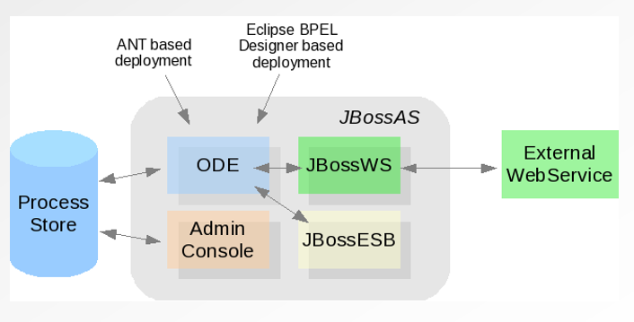

#BPEL : Orchestration de services métiers

<!-- .slide: class="page-title" -->


Notes :


## Contenu

- Le langage BPEL – Business Process Execution Language

- Les processus BPEL – Synchrones et Asynchrones

- Intégrer un monde hétérogène avec BPEL

- Quand utiliser un moteur BPEL ?

- Les bonnes pratiques en BPEL


Notes :


# Un processus BPEL

<!-- .slide: class="page-title" -->


Notes :


## Business Process

- Business Process (processus métier)
	- Répond à un besoin d'entreprise
	- S'adapte à un modèle de données métier
	- Réalise un ensemble d'actions et de tâches
	- Est un service

- Exemple de Business Process
	- Réservation de billets d'avion
	- Format d'entrée imposé
	- Vérifier disponibilité, appeler facturation, notifier client

Notes :


## BPEL – Quelle utilité ?

- Processus BPEL implémente un Business Process

- Processus BPEL expose un Web Service
	- Business Process exposé via Web Service (en BPEL)

- Orchestrateur de Web Services

- Abstraction

- Un processus BPEL orchestre l'appel à d'autres WS
	- Processus BPEL
	- Services externes

- Granularité inconnue du service appelé

Notes :


## Un processus BPEL

- Processus BPEL
	- WSDL
		- Types
		- Messages
		- Opérations / PortTypes
	- BPEL
		- PartnerLinks
		- Variables
		- Activités

Notes :


## Les composants – Fichier source

- Écrit en XML – véritable code source

- Tout est encapsulé dans la balise ```<process>```

- Appartient au schéma XMLhttp://docs.oasis-open.org/wsbpel/2.0/process/executable

- Détermine la logique métier, l'orchestration, les transformations

Notes :


## Un processus BPEL

<figure>
    
</figure>

Notes :


## Les composants – Fichier WSDL

- WSDL classique
	- Types, messages, opérations, portTypes, binding,service

- Ajout de la définition des partnerLinks
	- Un partnerLink est une interface d'un processus
	- Toutes les interfaces sont des partnerLinks
	- Permet de faire le lien vers un portType WSDL

```
<plnk:partnerLink Typename="Reservation">
<plnk:role name="ReservationProvider" portType="tns:ReservationPortType"/>
</plnk:partnerLinkType>
```

Notes :


## Les composants – Fichier descripteur

- N'est pas défini dans la spécification BPEL

- Tous les moteurs BPEL ont leur propre descripteur

- Permet généralement de relier les partnerLinkaux interfaces concrètes
	- Car les partnerlinks sont reliés au portType dans le WSDL, et donc à l'interface abstraite
	- Besoin de rattacher le service à appeler à son adresse physique (endpoint)

Notes :


## Les composants – Fichier descripteur

- Exemple de descripteur d'Apache ODE

```
<deploy xmlns="http://www.apache.org/ode/schemas/dd/2007/03"
              xmlns:BusinessFault="http://bpel.resanet.com/BusinessFault"
              xmlns:gestionerreur="http://bpel.resanet.com/gestionerreur">
    <process name="gestionerreur:GestionErreur">
    		<active>true</active>
    		<retired>false</retired>
    		<process-events generate="all"/>
    		<provide partnerLink="client">
          		<service name="gestionerreur:GestionErreurService" port="GestionErreurPort"/>
    		</provide>
    		<invoke partnerLink="businessFault">
        		 <service name="BusinessFault:BusinessFaultService" port="BusinessFaultPort"/>
    		</invoke>
     </process>
</deploy>
```

Notes :


## Fonctionnement d'un processus BPEL

- Un processus a un état
	- 1 point de démarrage,npoints d'arrêts
	- Sauvegarde de l'état (dehydration store)

- Maintient de variables

- Exécutions de manipulations sur des données uniquement en XML

- Appels de services internes ou externes

- Enchainement de traitements

<figure style="position: absolute; bottom: 310px; right: 10px;">
    
</figure>	


Notes :


# Apache ODE : moteur BPEL libre.

<!-- .slide: class="page-title" -->


Notes :


## Apache ODE

- Moteur BPEL de la fondation Apache

- Gratuit et open source, licence ASF

- La spécification WSBPEL 2.0 est 100% supportée

- Supporte 2 couches de communication
	- Web Services sur HTTP (Axis2)
	- Endpoints JBI (intégration à l'ESB ServiceMix)

- Supporte les Web Services REST

- Déploiement des processus BPEL à chaud

<figure style="position: absolute; bottom: 310px; right: 10px;">
    
</figure>

Notes :


## Apache ODE

- Plusieurs types de packaging
	- Application Web sous forme de WAR (moteurs de servlets, serveurs JEE)
	- Composant JBI, à déployer sur ServiceMix (ou autre contenur JBI)

- Support des processus durables

- Support du versionning des processus BPEL

Notes :


## Jboss Riftsaw

- Sur-couche à Apache ODE

- Intégration d'ODE à JBossAS v5

- Déploiement sur l'architecture JBoss

- Couche d'intégration basée sur JAXWS
	- Implémentation au choix (JbossNative, JAXWS-RI, CXF)

- Utilitaire Ant de déploiement

- Intégration facilitée avec JBoss ESB

<figure style="position: absolute; bottom: 350px; right: 10px;">
    
</figure>

<figure style="position: absolute; bottom: 200px; right: 10px;">
    
</figure>


Notes :


## Jboss Riftsaw




Notes :


## L'IDE BPEL – Installation

- Basé sur le plugin Eclipse BPEL (WSBPEL 2.0)

- Intégré dans les JBoss tools à partir de la v3.1
	- Nécessite Eclipse Helios 3.6

- Téléchargement des plugins via le site Jboss

	- Plugins SOA Developmenthttp://download.jboss.org/jbosstools/updates/stable/helios/

Notes :


## L'IDE BPEL – Présentation

- L'IDE propose désormais un onglet BPEL 2.0 dans les wizards de création
	- Descripteur de déploiement
	- Projet BPEL
	- Templates de processus BPEL

- Pas de perspective spécifique !


<figure style="position: absolute; bottom: 100px; right: 10px;">
    
</figure>


Notes :


## L'IDE BPEL – Édition

- L'IDE permet d'éditer graphiquement les processus BPEL

- Onglets Design & Source pour visualiser et interagir directement sur le XML source

<figure style="position: absolute; bottom: 50px; right: 10px;">
    
</figure>


Notes :


## L'IDE BPEL – Édition

- La palette graphique permet de créer et modifier les processus avec drag & drop des composants BPEL

- Toutes les activités BPEL 2.0 sont disponibles


<figure style="position: absolute; bottom: 50px; right: 10px;">
    
</figure>


Notes :


## L'IDE BPEL – Édition

- La vue *Properties* permet de spécifier les propriétés des différentes briques (receive, invoke, assign, etc.)

<figure style="position: absolute; bottom: 100px; right: 0px;">
    
</figure>

Notes :


## L'IDE BPEL – JDeveloper

- JDeveloper 10 propose un éditeur BPEL 1.1
	- Indispensable pour Oracle BPEL PM 10.1.3.x

- JDeveloper 11 dispose désormais d'un éditeur BPEL 2.0
	- Indispensable pour Oracle BPEL PM 11.1.1.x

- L'éditeur rajoute des descripteurs spécifiques au moteur Oracle

Notes :


<!-- .slide: class="page-tp9" -->


Notes :


# Les fondements du langage BPEL

<!-- .slide: class="page-title" -->


Notes :


## Introduction

- Le développement du processus BPEL est réalise dans le fichier portant l'extension.bpel

- Un nombre fini de briques ou d'activités BPEL constitue la syntaxe du langage
	- Analogie avec les mots clés d'un langage traditionnel

- Ces activités possède leur propre notation XML, avec également leurs propres attributs qui les composent

Notes :


## Activités d'orchestration -
*Receive*

- Permet de recevoir un message d'un partnerLink. L'attente est bloquante jusqu'à réception du message adéquat.
	- Création d'une instance d'un processus BPEL possible
	- Participation à une instance déjà en cours

- Notation XML


```
<bpel:receive name="receive" partnerLink="client" 
portType="tns:FormationBrique" 
operation="process" variable="input" createInstance="yes"/>
```

Notes :


## Activités d'orchestration -
*Reply*

- Envoie un message de réponse ou une exception à la fin d'une transaction synchrone
	- Utilisé uniquement sur les opérations synchrones (input / output)
	- Ne signifie pas obligatoirement la fin du processus

- Notation XML

```
<bpel:reply name="reply" partnerLink="client" 
portType="tns:FormationBrique" operation="process" 
variable="output"/>
```


Notes :


## Activités d'orchestration -
*Invoke*

- Envoie un message à un service partenaire (partnerLink), et récupère éventuellement la réponse
	- Peut appeler des opération synchrones (Request / Response)
	- Peut également appeler des opération asynchrones (One way)

- Notation XML

```
<bpel:invoke name="invoke" partnerLink="formationBrique" 
operation="process"
portType="tns:FormationBrique" inputVariable="inputVar" 
outputVariable="outputVar"/>
```


Notes :


## Manipulation de données - Assign

- Permet de manipuler les variables d’un processus
	- Initialisation de variables / mise à jour de variables
	- Copie de variables
	- Manipulation XML (via le langage XPath)
	- Possibilité de valider la variable sur son schéma XSD

Notes :


## Manipulation de données - Assign	
	
- Notation XML

```
<bpel:assign validate="no" name="assign">
<bpel:copy>
<bpel:frompart="payload" variable="input">
<bpel:query 
queryLanguage="urn:oasis:names:tc:wsbpel:2.0:sublang:xpath1.0">
<![CDATA[tns:input]]>
</bpel:query></bpel:from>
<bpel:topart="payload"variable="output">
<bpel:query 
queryLanguage="urn:oasis:names:tc:wsbpel:2.0:sublang:xpath1.0">
<![CDATA[tns:result]]></bpel:query></bpel:to>
</bpel:copy></bpel:assign>
```


Notes :


## Activités structurantes – Scope

- Découpe en différentes parties logiques un processus BPEL
	- Déclaration de variables locales
	- Récupération d'exceptions, compensations

- Permet d'avoir des activités imbriquées
	- Ne peut contenir qu'une seule activité

- Notation XML

```
<bpel:scope name="scope">[...]</bpel:scope>
```


Notes :


## Activités structurantes – Sequence

- Permet d'avoir une série d'activités, exécutées de manière séquentielle

- Permet d'avoir des activités imbriquées
	- Peut contenir *n* activités

- Notation XML

```
<bpel:sequence name="sequence">[...]</bpel:sequence>
```

Notes :


## Activités structurantes – Flow

- Permet d'avoir une série d'activités, exécutées de manière concurrentes
	- L'exécution simultanée dépend des implémentations des moteurs BPEL

- Permet d'avoir des activités imbriquées
	- Peut contenir *n* activités

- Notation XML

```
<bpel:flow name="flow">[...]</bpel:flow>
```


Notes :


## Activités conditionnelles – If - Else if - Else

- Fournit *n* branches conditionnelles
	- Chacune de ces branches est associée à une expression booléenne
	- La première branche (de gauche à droite) dont la condition est vraie est exécutée
	- Si aucune condition vérifiée, la branche *Else* est finalement exécutée


```
<bpel:if name="if">
<bpel:condition><![CDATA[true()]]></bpel:condition>[...]
<bpel:elseif><bpel:condition><![CDATA[true()]]>
</bpel:condition>
</bpel:elseif><bpel:else>[...]</bpel:else></bpel:if>
```


Notes :


## Activités itératives – While

- Effectue le traitement aussi longtemps que la condition booléenne spécifiée est vraie
	- Expression XPath


```
<bpel:while name="While">
<bpel:condition><![CDATA[true()]]></bpel:condition>[...]
</bpel:while>
```


Notes :


## Activité - Wait

- Attente bloquante
	- Statiquement
	- Dynamiquement avec expression XPath

- La nature de l'attente est soit
	- Une durée *for*
	- Une date déterminée *until*

- Notation XML

```
<bpel:wait name="wait">
<bpel:for><![CDATA['PT1H']]></bpel:for>
</bpel:wait>
```

Notes :


## Activité - Pick

- Attente bloquante
	- Jusqu'à ce qu'un des types de messages précisés arrive
	- Ou jusqu'à ce que le timer expire
	- Lorsque un message arrive, l'attente des autres types de message est désactivée

- Situé dans le flux du processus BPEL


```
<bpel:pick name="Pick">
<bpel:onMessage partnerLink="client" operation="process" variable="input">
<bpel:scope name="Scope">[...]</bpel:scope></bpel:onMessage>
<bpel:onAlarm>
<bpel:scope name="Scope">[...]</bpel:scope><bpel:for><![CDATA['PT1H']]></bpel:for>
</bpel:onAlarm></bpel:pick>
```

Notes :


<!-- .slide: class="page-tp10" -->

Notes :


# Manipulation variables XML

<!-- .slide: class="page-title" -->


Notes :


## Manipulation XML en BPEL

- Rappel : Toutes les données manipulées nativement par BPEL sont au format XML
	- Messages reçus, Variables internes

- Les activités *assign* sont les seules activités permettant de manipuler les données XML
	- Manipulation directe
	- Manipulation littérale
	- Manipulation d'expressions

- Utilisée pour copier une source vers
	- Une variable
	- Un partnerLink (considéré comme une variable en BPEL)

Notes :


## Initialisation des variables XML

- Avant de pouvoir manipuler une variable XML, il est indispensable de l'initialiser
	- Avec les données XML souhaitées
	- Pour éviter les selections *Failure*
- Pour cela, il faut utiliser le mode literal

```
<bpel:from>
<bpel:literal>
<monFragmentXML><id/></monFragmentXML>
</bpel:literal>
</bpel:from>
```

Notes :


## Les fonctions XPath génériques

- BPEL utilise constamment les expressions XPath
	- Pour toutes les conditions
	- Pour accéder au données dans lesassign

- BPEL utilise également les fonctions XPath standard, et étendue
	- concat()
	- substring()
	- count()
	- contains()
	- position()

Notes :


## Les fonctions XPath génériques

- 
	- start-with()
	- etc.

- Cette liste dépend généralement des implémentations

Notes :


## Le langage XPath dans BPEL

- Depuis BPEL 2.0, la spécification impose en plus le support de la fonction suivante
	- bpel:doXSLTransform pour réaliser directement les transformation XSLT, sans passer par une fonction propriétaire
	- Support natif des transformations XSLT

- L'ancienne fonction bpws:getVariableDataqui était utilisé pour accéder aux variables est remplacée par un « $ »
	- BPEL 1.1 →bpws:getVariableData("message", "payload", "tns:in")
	- BPEL 2.0 →$message.payload/tns:in
	- Simplifie énormément la lisibilité du code
	- Simplifie également le développement
	
Notes :


## Les fonctions custom XPath

- Bien que cela ne soit pas indiqué dans la spécification, 
tous les éditeurs de moteur BPEL offre la possibilité d'utiliser des fonctions custom XPath

- Fonction custom XPath
	- Fonction XPath utilisateur réalisant le traitement désiré
	- Il est donc possible d'étendre les capacités de BPEL à l'infini

- Apache ODE utilise le moteur Saxon 9, ces fonctions doivent donc être écrites en Java
	- xmlns:fonc="java:com.resanet.xpath.MaCustomXPath"
	- Avec ce type de namespace, Saxon enregistre directement la XPath et la rend disponible au runtime dans le processus BPEL

Notes :


## Fonction custom XPath pour Apache ODE

- Développer une classe Java ayant une méthodestatic,et la positionner dans le classpath

```
package com.resanet.bpel.xpath;
public class ConcatString {
/*** Concatène deux String.
**@paramstr1 string numéro 1
*@paramstr2 string numéro 2
**@returnun nouveau String*/

public static String concat(String str1, String str2) {
return str1.concat(str2);
}}
```

- Déclarer le namespace dans le processus BPEL
	- xmlns:cnct="java:com.resanet.bpel.xpath.ConcatString"

Notes :


## Fonction custom XPath pour Apache ODE

- Utiliser sa fonction XPath dans un *assign* par exemple

- Attention
	- Il faut utiliser le xpath2.0 pour utiliser les XPath avec Saxon

```	
<bpel:copy>
<bpel:from 
expressionLanguage="urn:oasis:names:tc:wsbpel:2.0:sublang:xpath2.0
">
<![CDATA[cnct:concat($input.payload/tns.input, ' world')]]>
</bpel:from>
<bpel:to part="payload" variable="output">
<bpel:query 
queryLanguage="urn:oasis:names:tc:wsbpel:2.0:sublang:xpath1.0">
<![CDATA[tns:result]]>
</bpel:query></bpel:to></bpel:copy>
```

Notes :


## Les fonctions custom XPath

- Grâce à ce procédé, nous pouvons très simplement passer dans le monde Java
	- Possibilité de passer des paramètres
	- Peut retourner un résultat

- Tout le potentiel du langage Java est alors à disposition
	- Spring
	- Java EE
	- etc.

Notes :


## Les transformations XSLT

- XSLT –eXtensible Stylesheet Language Transformations
	- Basé sur le langage XSL

- Langage de transformation XML
	- À partir de 2 documents
		- Document XML
		- Feuille XSLT (CSV, PDF, XML, ...)

- On applique la transformation pour produire un nouveau document XML en sortie

- Langage basé sur XPath pour naviguer dans l'arbre XML

Notes :


## Les transformations XSLT

- Exemple d'une feuille XSLT

```
<?xml version="1.0" encoding="UTF-8"?>
<xsl:stylesheet version="1.0" 
xmlns:xsl="http://www.w3.org/1999/XSL/Transform"
xmlns:tns="http://bpel.tnsnet.com/xslt">

<xsl:template match="/">
<tns:output>
<xsl:value-of select="tns:input/tns:value"/>
</tns:output></xsl:template>
</xsl:stylesheet>
```

Notes :


## Les transformations XSLT en BPEL

- BPEL est capable d'utiliser les transformations XSLT
	- Fonction XPath appelant un moteur de transformation

- En BPEL 2.0
	- Support natif des transformations XSLT
	- XPath bpel:doXSLTransform pour réaliser directement les transformation XSLT, sans passer par une fonction propriétaire
	- object bpel:doXslTransform(string, node-set, (string, object)*)


Notes :


## Les transformations XSLT en BPEL

- Les paramètres fournis à la feuille XSL sont du type
	- String = QName du paramètre
	- Object = Valeur du paramètre (variable, expression Xpath)

- Il est possible de fournir n paramètres

- Les manipulation complexes de données doivent être réalisées en XSLT
	- Le langage BPEL n'est pas prévu pour cela
	- Très difficile à maintenir en BPEL

- Exemple bpel:doXslTransform("xslt/feuille.xslt", $var)

Notes :


<!-- .slide: class="page-tp11" -->

Notes :


# Orchestration de services

<!-- .slide: class="page-title" -->


Notes :


## Les fondements de l'orchestration

- 2 types de communications possibles dans l'histoire des systèmes d'informations
	- Synchrone
	- Asynchrone

- Il faut réserver les échanges synchrones dans le cadre de requêtes nécessitant une réponse (quasi-) immédiate

- Il est souvent préférable, si possible, de privilégier les échanges asynchrones au sein d'un système d'information pour une question de robustesse
	- Réseau surchargé
	- Base de données HS


Notes :


## Les fondements de l'orchestration

- Synchrone
	- Request / Response
	- Réponse immédiate (quelques secondes)
	- Peut éventuellement retourner une Fault
	- L'attente de la réponse est bloquante


Notes :


## WSDL synchrone

- WSDL synchrone

```
<message name="RequestMessage">
<partname="payload"element="tns:Request"/></message>
<message name="ResponseMessage">
<partname="payload"element="tns:Response"/></message>
<portType name="operationSynchrone">
<operation name="process">
<input message="tns:RequestMessage"/>
<output message="tns:ResponseMessage"/>
</operation></portType>[...]
````

Notes :


## Asynchrone

- Asynchrone
	- One way
	- Pas de réponse, ni de Fault
	- Aucune attente du côté du client
	- Méthode « send and forget »
	- Comment avoir un retour ?

<figure>
    
</figure>


Notes :


## WSDL asynchrone

- WSDL asynchrone

```
	<message name="RequestMessage">
		<part name="payload" element="tns:Request"/>
	</message>

	<portType name="operationAsynchrone">
		<operation name="process">
			<input message="tns:RequestMessage"/>
		</operation>
	</portType>
```

Notes :


## Asynchrone – Obtenir une réponse

- Asynchrone
	- Pas de réponse car uniquement une requête dans l'opération d'appel

- Il faut une autre opération asynchrone pour envoyer une réponse
	- Cette opération doit être implémentée côté client
	- Opération de callback
	- Serveur → client


<figure style="position: absolute; bottom: 100px; right: 10px;">
    
</figure>

Notes :


## Asynchrone – Obtenir une réponse


Notes :


## Asynchrone – Obtenir une réponse

- WSDL asynchrone pour la réponse (callback)

```
	<message name="RequestMessage">
		<part name="payload" element="tns:Request"/>
	</message>

	<portType name="operationAsynchrone">
		<operation name="initiate">
			<input message="tns:RequestMessage"/>
		</operation>
	</portType>
````

Notes :


## Asynchrone et callback – WSDL

- L'intégralité de ces informations sont portés par le WSDL côté serveur
	- L'opération *initiate* est implémentée côté serveur
	- L'opération *onResultest* implémentée côté client

```
<message name="RequestMessage">
<partname="payload"element="tns:Request"/></message>
<message name="ResponseMessage">
<partname="payload" element="tns:Response"/></message>
<portType name="operationAsynchrone"><operationname="initiate">
<input message="tns:RequestMessage"/></operation>
</portType><portType name="operationAsynchroneCallback">
<operationname="onResult">
<input message="tns:ResponseMessage"/>
</operation>
</portType>
```

Notes :


## Asynchrone et callback – WSDL

- Il y a alors 2 services à définir
	- Celui qui fournit l'opération initiate
	- Celui qui fournit l'opération onResult (à implémenter par le client)

```
<service name="ProcessService">
<port name="ProcessPort" binding="tns:ProcessBinding">
<soap:address 
location="http://localhost:8080/Process"/></port></service>

<service name="ProcessServiceCallback">
<port name="ProcessCallbackPort" 
binding="tns:ProcessCallbackBinding">
<soap:addresslocation="http://set.by.caller"/></port></service>
```

Notes :


## Asynchrone – Corrélations

- La corrélation est un moyen pour déterminer si plusieurs messages (au moins 2) ont un lien entre eux

- Exemple
	- Appel d'un service de réservation de billets d'avion asynchrone
	- Fourniture d'un identifiant de commande dans la requête
	- La réponse du serveur retourne ce même identifiant
	- Le client peut corréler la réponse avec la requête

- La corrélation est indispensable pour les communications asynchrones
	- Si pas de corrélation, impossible de rattacher la réponse reçue avec la requête envoyée

Notes :


## BPEL – Corrélations

- BPEL utilise la corrélation entre les messages qui transitent sur les différentes interfaces (partnerLinks)

- Lors d'un callback asynchrone, un message est envoyé via un Web Service sur un portType déterminé

- Problème
	- L'exécution d'un processus BPEL est nommée instance BPEL
	- Plusieurs instances d'un même processus BPEL peuvent être actives simultanément
	- Comment savoir à quelle instance le message reçu doit être envoyée ?
	- c'est le rôle de la corrélation

Notes :


## BPEL – Corrélations

- Il existe deux types de corrélation
	- Corrélation native (implicit correlation)
	- Custom corrélation (explicit correlation)

- La corrélation native est mise en œuvre automatiquement par BPEL pour les communications entre processus BPEL

- La custom corrélation est à implémenter manuellement afin de pouvoir recevoir des messages externes


Notes :


## BPEL – Corrélations

- Chaque instance BPEL qui veut recevoir un callback doit initier des paramètres de corrélation

- Ainsi, le moteur BPEL sait que le message reçu qui satisfait les paramètres de corrélation de telle instance doit lui être envoyé

- Attention
	- Les corrélations sont uniquement utilisées lorsque l'on souhaite attacher un message à une instance donnée
	- Lors de création d'instance BPEL, la corrélation n'est pas nécessaire puisque l'instance n'existe pas encore

Notes :


## BPEL – Interactions entre processus BPEL

- La spécification ne traite pas le sujet des interactions entre les processus BPEL
	- Utilisation de la corrélation native

- Cependant, la majorité des implémentations implémente la corrélation native
	- La communication asynchrone entre processus BPEL est totalement transparente pour le concepteur
	- Pas de custom corrélation à mettre en place
	- Tout est gérer automatiquement
	- Basée sur le WS-Addressing sur Oracle
	- Basée sur un session id sur ODE

- Supportée chez Oracle BPEL, Apache ODE

Notes :


## BPEL – Le WS-Addressing

- Spécification WS-*

- WS-Addressing permet aux Web Services de communiquer des informations d’adressage

- Les données de routage de messages incluses au header SOAP

```
<Envelope>
<Header><Action>http://resanet/hotelPortType/reserver</Action>
<MessageID>urn:uuid:0123456789</MessageID>
<To>http://localhost:8080/services/hotel</To>
<ReplyTo><Address>http://localhost:9990/decoupled_endpoint</Address></ReplyTo>
</Header><Body>
```

Notes :


## BPEL – Le WS-Addressing

- Au retour

```
<Envelope>
<Header>
<Action>http://resanet/hotelPortType/reserverResponse</Action>
<MessageID>urn:uuid:345123</MessageID>
<To>http://localhost:9990/decoupled_endpoint</To>
<RelatesTo>urn:uuid:0123456789</RelatesTo></Header><Body>
```

Notes :


## BPEL – Interactions entre processus

- Le principe de la corrélation native
	- La corrélation s'effectue simplement de façon transparente
	- Les données ne sont pas des données utilisateurs, mais des données techniques ajoutées dans le Header SOAP.

- Le WSA est la norme provenant du W3C adoptée pour toutes les problématiques de corrélations entre les Web Services asynchrones

Notes :


## BPEL – Exemple corrélation native


Notes :


## BPEL – Exemple corrélation native


Notes :


## BPEL – Exemple corrélation native


Notes :


## BPEL – Exemple corrélation native


Notes :


## BPEL – Interactions externes

- Il est possible d'envoyer des messages externes à BPEL
	- Messages qui ne proviennent pas directement d'autres processus
	- Messages envoyés soit
		- d'un autre système
		- d'un moteur de workflow
		- d'une IHM
		- etc.

Notes :


## BPEL – Interactions externes

- Il faut alors mettre les mécanisme de corrélation custom en place
	- Impossible d'utiliser la corrélation native étant donné que le moteur ne gère pas le parternlink
	- Obligation d'utiliser la custom corrélation
	- → Le principe et le fonctionnement sont strictement identiques à une corrélation native

Notes :


# Intégrer un monde hétérogène

<!-- .slide: class="page-title" -->


Notes :


## Comment intégrer un SI existant ?

- Le langage BPEL est conçu et implémenter pour s'interfacer avec des interfaces Web Services uniquement
	- Attention, il s'agit uniquement d'une interface

- Problème
	- Comment intégrer le reste du monde ?
	- Base de données ?
	- JMS ?
	- Fichiers ?
	- HTTP ?
	- Web Services différents (REST, RPC) ?
	- etc.

Notes :


## Les adaptateurs

- Introduction de la notion d'adaptateurs
	- Également nommés
		- Adapters
		- Connecteurs

- Un adaptateur en BPEL reprend la même notion que le très célèbre design pattern Adapter

<figure>
    
</figure>


Notes :


## Utilisation des adaptateurs

- Les adaptateurs permettent de faire le pont entre le monde des Web Services et
	- Une autre technologie
	- Un autre protocole

- Il est alors possible d'intégrer toutes les applications possibles et existantes, même si elles communiquent avec un format propriétaire

- Les adaptateurs les plus courants
	- JMS
	- Base de données
	- Fichiers (via un tamponage en base de données parfois)

Notes :


## Utilisation des adaptateurs

- De façon générale, un adaptateur permet d'accéder et de communiquer avec une ressource externe

<figure>
    
</figure>


Notes :


## Développer un adaptateur en Java

- La première des chose à faire → le WSDL
	- Définir les types de données qui transitent
	- Définir les opérations à implémenter

- Génération du code Java (mode contract-first) JAXWS
	- CXF
	- JAXWS-RI
	- JBossWS (sur JBoss AS5), SwitchYard

- Implémentation du Web Service

- Déploiement

Notes :


## Un adaptateur JMS

- Exemple – un adaptateur JMS
	- Web Service JAXWS-RI pour réception de la requête
	- Envoi sur file JMS
	- Réception avec un MDB
	- Callback de l'instance BPEL via un message externe

<figure>
    
</figure>

Notes :


## Exemple d'adaptateurs

- Exemple – un adaptateur JMS
	- Dans ce cas, l'adaptateur est asynchrone
	- Ne pas oublier de gérer la corrélation (via les custom corrélation)
	- Le message JMS doit porter l'information de corrélation (JMSCorrelationID)
	- Si impossible de faire transiter un même identifiant de BPEL jusqu'au message JMS, l'adaptateur doit gérer son propre mécanisme de corrélation

Notes :


## Exemple d'adaptateurs

- Exemple – un adaptateur base de données
	- Cet adaptateur serait plutôt du type synchrone
	- Très simple à mettre en œuvre
	- Appel du Web Service
	- Exécution de la requête SQL
	- Retour des résultats dans la réponse synchrone

Notes :


## Les adaptateurs des moteurs BPEL

- Certaines implémentations de moteur BPEL fournissent par défaut des adaptateurs

- L'implémentation Oracle fournit

	- Base de données
	- JMS, MQ, AQ
	- Fichier
	- FTP
	- SAP, etc.


- Il faut être prudent avec les implémentations proposées
	- Pas toujours adapté au besoin très spécifique des projets
	- La performance n'est pas toujours au rendez-vous du fait de la généricité de ces composants

Notes :


# Bonnes pratiques

<!-- .slide: class="page-title" -->


Notes :


## Les bonnes pratiques

- Créer des scopes
	- Avoir des variables locales
	- Lisibilité du code
	- Performance

- Éviter les manipulations trop complexes dans les assigns
	- Privilégier les feuille XSL
	- Performance
	
- Attention aux activités *empty*
	- Performance sur certaines implémentations

Notes :


## Les bonnes pratiques

- Créer des processus asynchrones
	- Pas trop de niveau hiérarchique
	- Performance

- Privilégier les processus synchrones pour processus simples
	- Performance
	- Moins de contraintes

- Utiliser BPEL comme middleware uniquement
	- Logique de routage
	- Suite d'échanges entre différents services
	- Ne pas utiliser comme un langage de programmation

Notes :


<!-- .slide: class="page-questions" -->
